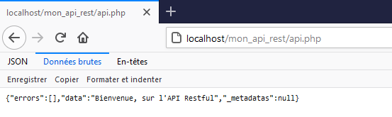

# API Restful PHP-PV

## Présentation

L'API Restful est l'élément d'Application qui délivre un service web JSON-RPC, respectant l'architecture REST.

## Installation

Mettons en place cette structure de notre projet :

```
/mon_api_rest
	/php-pv-master
	/api.php
	/.htaccess
```

Placez ce contenu dans le **.htaccess**.

```
<IfModule mod_rewrite.c>
    Options -MultiViews
    RewriteEngine On
	RewriteCond %{REQUEST_FILENAME} !-f
	RewriteCond %{REQUEST_FILENAME} !-d
	RewriteRule ^.*$ api.php [L,QSA]
</IfModule>
```

Maintenant, déclarez l'application, l'API Restful et sa ressource par défaut dans **api.php**.

```php
<?php
// Inclure la librairie PHP-PV nécessaire
include dirname(__FILE__)."/php-pv-master/autoload.php" ;
// Déclaration de la route par défaut
class RouteAccueilRestful1 extends \Pv\ApiRestful\Route\Route
{
	public function ExecuteInstructions()
	{
		$this->ContenuReponse->data = "Bienvenue, sur l'API Restful" ;
	}
}
// Déclaration de l'API Restful
class ApiRestful1 extends \Pv\ApiRestful\ApiRestful
{
	public $AccepterTousChemins = 1 ;
	public $CheminRacineApi = "/mon_api_rest/api.php" ; // Chemin relatif du serveur web
	protected function ChargeRoutes()
	{
		$this->InsereRouteParDefaut(new RouteAccueilRestful1()) ;
	}
}
// Application
class Application1 extends \Pv\Application\Application
{
	protected function ChargeIHMs()
	{
		// déclarez l'API comme IHM
		$this->InsereIHM('api1', new ApiRestful1()) ;
	}
}
// Exécuter l'Application
$app = new Application1() ;
$app->Execute() ;
```

Exécutez http://localhost/mon_api_rest/api.php



## Caractéristiques

- [Gestion du routage](apirestful/routage.md)
- [La route Collection](apirestful/collection.md)
- [La route Individuelle](apirestful/individuel.md)
- [Le système d'authentification](apirestful/auth.md)

## Propriétés d'initiation

Propriété | Description
------------ | -------------
\$CheminRacineApi | Chemin Racine de l'API Restful
\$OriginesAutorisees | Hôtes autorisées pour des appels Ajax. Définit l'entête HTTP "Access-Control-Allow-Origin"
\$EncodageDocument | Encodage du document
\$CrypterReponse | 0 = ne pas crypter (par défaut), 1 = crypter uniquement la valeur data, 2 = crypter toute la réponse. Après avoir décrypté la valeur, vous devez decoder le résultat JSON pour l'utiliser.
\$CleCryptReponse | Clé utilisée lors du cryptage. valeur par défaut : AP1Res6Ful142.
\$HmacCryptReponse | Valeur HMAC lors du cryptage. valeur par défaut : sha256.
\$CypherCryptReponse | Valeur HMAC lors du cryptage. valeur par défaut : AES-256-CBC.
\$InclureStatutReponse | Inclut la propriété status dans la réponse. Ses valeurs sont : success = OK, error = Erreur survenue.

```php
class ApiRestful1 extends \Pv\ApiRestful\ApiRestful
{
	public $EncodageDocument = "iso-8859-1" ;
	public $InclureStatutReponse = false ;
}
```


