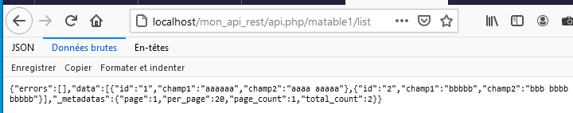

# La Route Restful collection - PHP-PV

## Présentation

La route collection est **\Pv\ApiRestful\Route\Collection**. Elle affiche une liste d'éléments sous forme de rangée.

```php
class RouteCollect1Restful1 extends \Pv\ApiRestful\Route\Collection
{
	public function ExecuteInstructions()
	{
		$this->FournisseurDonnees->BaseDonnees = new MaBD() ;
		$this->FournisseurDonnees->RequeteSelection = "matable1" ;
		$this->InsereFltSelectHttpGet("terme", "champ1 like concat('%', <self>, '%')") ;
		$this->InsereDefCol("id", "ID") ;
		$this->InsereDefCol("champ1", "Champ No.1") ;
		$this->InsereDefCol("champ2", "Champ No.2") ;
	}
}
```

 

## Métadonnées renvoyées

Pour naviguer, la route retourne les métadonnées :

- page : Numero de la rangée sélectionnée, commençant par 1.
- per_page : Nombre d'éléments maximum dans une rangée
- page_count : Nombre de rangées
- total_count : Total d'éléments

## Filtres de données

La route possède les filtres de sélection dans sa propriété **\$FiltresSelection**.

```php
class RouteCollect1Restful1 extends \Pv\ApiRestful\Route\Collection
{
	public function ExecuteInstructions()
	{
		// ...
		$this->InsereFltSelectHttpGet("titre", "titre = <self>") ;
		$this->ContenuReponse->data = count($this->FiltresSelection)." colonnes trouvees" ;
		// ...
	}
}
```

Plusieurs méthodes sont disponibles pour inscrire un filtre de données.

Propriété/Méthode | Description
------------ | -------------
InsereFltSelectFixe(\$nom, \$valeur, \$exprDonnees='') | Inscrit un filtre avec la valeur fixe \$valeur
InsereFltSelectHttpGet(\$nom, \$exprDonnees='') | Inscrit un filtre issu d'un paramètre GET
InsereFltSelectHttpCorps(\$nom, \$exprDonnees='') | Inscrit un filtre issu d'un paramètre soumis dans le corps de le requête

```php
class RouteCollect1Restful1 extends \Pv\ApiRestful\Route\Collection
{
	public function ExecuteInstructions()
	{
		// ...
		$this->InsereFltSelectFixe("est_actif", 1, "active = <self>") ;
		$this->InsereFltSelectHttpGet("id", "id = <self>") ;
		// ...
	}
}
```

Pour vérifier si les filtres sont bien renseignés, réécrivez la méthode **ValideFiltresExecution()** et placez le message d'erreur dans **\$MessageErreurExecution**.

```php
class RouteCollect1Restful1 extends \Pv\ApiRestful\Route\Collection
{
	public function ExecuteInstructions()
	{
		// ...
		$this->FltTitre = $this->InsereDefCol("titre", "Titre") ;
		// ...
	}
	public function ValideFiltresExecution()
	{
		if($this->FltTitre->Lie() == "")
		{
			$this->MessageErreurExecution = "Veuillez renseigner un titre" ;
		}
	}
}
```

## Colonnes de données

La route possède les colonnes dans sa propriété **\$DefinitionsColonnes**.

```php
class RouteCollect1Restful1 extends \Pv\ApiRestful\Route\Collection
{
	public function ExecuteInstructions()
	{
		// ...
		$this->InsereDefCol("titre", "Titre") ;
		$this->ContenuReponse->data = count($this->DefinitionsColonnes)." colonnes trouvees" ;
		// ...
	}
}
```

Plusieurs méthodes sont disponibles pour inscrire une colonne.

Propriété/Méthode | Description
------------ | -------------
InsereDefCol($nomDonnees, $libelle="", $aliasDonnees="") | Inscrit une colonne
InsereDefColBool($nomDonnees, $libelle="", $aliasDonnees="", $valPositive="", $valNegative="") | Inscrit une colonne Booléenne.
InsereDefColChoix($nomDonnees, $libelle="", $aliasDonnees="", $valsChoix=array()) | Inscrit une colonne dont la valeur correspond à des mots clés
InsereDefColMonnaie($nomDonnees, $libelle="", $aliasDonnees="") | Inscrit une colonne dont les valeurs seront formattées en monnaie.
InsereDefColMoney($nomDonnees, $libelle="", $aliasDonnees="") | Inscrit une colonne dont les valeurs seront formattées en monnaie.
InsereDefColDateFr($nomDonnees, $libelle="", $inclureHeure=0) | Inscrit une colonne dont les valeurs seront formattées en date d/m/Y.
InsereDefColDateTimeFr($nomDonnees, $libelle="", $aliasDonnees="") | Inscrit une colonne dont les valeurs seront formattées en date d/m/Y H:i:s.
InsereDefColFixe($valeur, $libelle="") | Inscrit une colonne avec une valeur par défaut
InsereDefColHtml($modeleHtml="", $libelle="") | Inscrit une colonne qui renvoie du contenu HTML
InsereDefColTimestamp($nomDonnees, $libelle="", $formatDate="d/m/Y H:i:s") | Inscrit une colonne dont les valeurs seront converties du timestamp en date d/m/Y H:i:s.

```php
class RouteCollect1Restful1 extends \Pv\ApiRestful\Route\Collection
{
	public function ExecuteInstructions()
	{
		// ...
		$this->InsereDefCol("id", "ID") ;
		$this->InsereDefColBool("est_actif", "Actif") ;
		$this->InsereDefColMoney("montant", "Montant") ;
		$this->InsereDefColDateTimeFr("date_creation", "Date_creation") ;
		// ...
	}
}
```

## Propriétés/méthodes spécifiques

Propriété/Méthode | Description
------------ | -------------
\$IndiceColonneTri | Index de colonne de tri par défaut.
\$NePasTrier | N'autorise pas le tri sur les colonnes
\$MessageAucunElement | Message à renvoyer si le tableau ne possède pas d'éléments
\$MaxElementsPossibles | Tableau contenant les maximums d'éléments que la route peut renvoyer.

```php
class RouteCollect1Restful1 extends \Pv\ApiRestful\Route\Collection
{
	public function ExecuteInstructions()
	{
		// ...
		$this->MessageAucunElement = "Aucune categorie trouvée" ;
		// ...
	}
}
```

## Propriétés/méthodes après rendu

Propriété/Méthode | Description
------------ | -------------
\$ElementsEnCoursBruts | Lignes renvoyées depuis le fournisseur de données, sans formattage.
\$ElementsEnCours | Lignes formattées à partir des colonnes.
\$IndiceDebut | Index de l'élémént
\$TotalElements | Total de lignes dans la requête du fournisseur de données
\$TotalRangees | Total de rangées dans la requête du fournisseur de données

```php
class RouteCollect1Restful1 extends \Pv\ApiRestful\Route\Collection
{
	public function TermineExecution()
	{
		parent::TermineExecution() ;
		if(count($this->ElementsEnCours) > 0)
		{
			foreach($this->ContenuReponse->data as $i => $val)
			{
				$this->ContenuReponse->data[$i]["position"] = $i + 1 ;
			}
		}
	}
}
```

## Autres liens

- [La gestion du routage](routage.md)
- [La route Individuelle](individuel.md)
