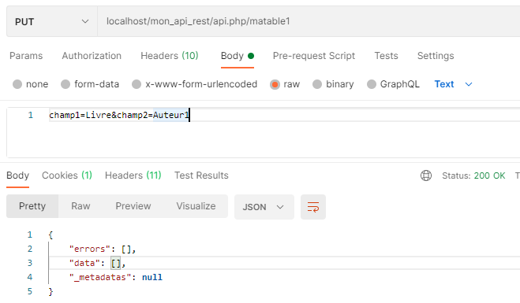

# La Route Restful Individuelle - PHP-PV

## Présentation

La route individuelle est **\Pv\ApiRestful\Route\Individuel** (ou **\Pv\ApiRestful\Route\Single**).
Elle traite les éditions dans une table et/ou renvoie une ligne. 

```php
class RouteEdit1Restful1 extends \Pv\ApiRestful\Route\Single
{
	public function ExecuteInstructions()
	{
		$this->FournisseurDonnees->BaseDonnees = new MaBD() ;
		$this->FournisseurDonnees->RequeteSelection = "matable1" ;
		$this->FournisseurDonnees->TableEdition = "matable1" ;
		$this->InsereFltSelectHttpGet("id", "id = <self>") ;
		$this->InsereFltEditHttpCorps("champ1", "champ1") ;
		$this->InsereFltEditHttpCorps("champ2", "champ2") ;
		$this->InsereFltEditFixe("champ3", rand(1, 9), "champ3") ;
	}
}
```



Requête CURL d'ajout
```
curl --location --request PUT 'localhost/mon_api_rest/api.php/matable1' \
--header 'Content-Type: application/x-www-form-urlencoded' \
--data-urlencode 'champ1=Livre' \
--data-urlencode 'champ2=Peau'
```

Requête CURL de modification
```
curl --location --request PATCH 'localhost/mon_api_rest/api.php/matable1?id=3' \
--header 'Content-Type: application/x-www-form-urlencoded' \
--data-urlencode 'champ1=Livre' \
--data-urlencode 'champ2=Peau'
```

Requête CURL de suppression
```
curl --location --request DELETE 'localhost/mon_api_rest/api.php/matable1?id=3'
```

Requête CURL de sélection
```
curl --location --request GET 'localhost/mon_api_rest/api.php/matable1?id=2'
```

## Propriétés d'initiation

Propriété/Méthode | Description
------------ | -------------
\$AutoriserSelect | Active la sélection de ligne dans cette route
\$AutoriserAjout | Active l'ajout dans cette route
\$AutoriserModif | Active la modification dans cette route
\$AutoriserSuppr | Active la suppression dans cette route
\$AutoriserDesact | Active la désactivation dans cette route, au lieu de supprimer la ligne. Valeur par défaut : false.
\$ValeursDesact | Valeurs des colonnes qui appliquent dans la désactivation dans la table.

```php
class RouteEdit1Restful1 extends \Pv\ApiRestful\Route\Single
{
	public $AutoriserAjout = false ;
	public $AutoriserSelect = false ;
	public $AutoriserDesact = true ;
	public $ValeursDesact = array("est_actif" => 0) ;
	// ...
}
```

## Filtres de données sélection

La route possède les filtres de sélection dans sa propriété **\$FiltresSelection**.

```php
class RouteSingle1Restful1 extends \Pv\ApiRestful\Route\Individuel
{
	public function ExecuteInstructions()
	{
		// ...
		$this->InserFltSelectHttpGet("id", "id = <self>") ;
		$this->ContenuReponse->data = count($this->FiltresSelection)." colonnes trouvees" ;
		// ...
	}
}
```

Plusieurs méthodes sont disponibles pour inscrire un filtre de données.

Propriété/Méthode | Description
------------ | -------------
InsereFltSelectFixe(\$nom, \$valeur, \$exprDonnees='') | Inscrit un filtre avec la valeur fixe \$valeur
InsereFltSelectHttpGet(\$nom, \$exprDonnees='') | Inscrit un filtre issu d'un paramètre GET
InsereFltSelectHttpCorps(\$nom, \$exprDonnees='') | Inscrit un filtre issu d'un paramètre soumis dans le corps de le requête

```php
class RouteSingle1Restful1 extends \Pv\ApiRestful\Route\Individuel
{
	public function ExecuteInstructions()
	{
		// ...
		$this->InsereFltSelectFixe("est_actif", 1, "active = <self>") ;
		$this->InsereFltSelectHttpGet("id", "id = <self>") ;
		// ...
	}
}
```

## Filtres de données édition

La route possède les filtres de édition dans sa propriété **\$FiltresEdition**.

```php
class RouteSingle1Restful1 extends \Pv\ApiRestful\Route\Individuel
{
	public function ExecuteInstructions()
	{
		// ...
		$this->InsereFltEditHttpCorps("titre", "titre") ;
		$this->InsereFltEditHttpCorps("description", "description") ;
		$this->InsereFltEditFixe("id_categorie", $_GET["id_categorie"]) ;
		$this->ContenuReponse->data = count($this->FiltresEdition)." colonnes trouvees" ;
		// ...
	}
}
```

Plusieurs méthodes sont disponibles pour inscrire un filtre de données.

Propriété/Méthode | Description
------------ | -------------
InsereFltEditFixe(\$nom, \$valeur, \$exprDonnees='') | Inscrit un filtre avec la valeur fixe \$valeur
InsereFltEditHttpGet(\$nom, \$exprDonnees='') | Inscrit un filtre issu d'un paramètre GET
InsereFltEditHttpCorps(\$nom, \$exprDonnees='') | Inscrit un filtre issu d'un paramètre soumis dans le corps de le requête

```php
class RouteSingle1Restful1 extends \Pv\ApiRestful\Route\Individuel
{
	public function ExecuteInstructions()
	{
		// ...
		$this->InsereFltEditFixe("est_actif", 1, "active = <self>") ;
		$this->InsereFltEditHttpGet("id", "id = <self>") ;
		// ...
	}
}
```

## Validation des filtres

Pour vérifier si les filtres sont bien renseignés, réécrivez la méthode **ValideFiltresExecution()** et placez le message d'erreur dans **\$MessageErreurExecution**.

```php
class RouteSingle1Restful1 extends \Pv\ApiRestful\Route\Individuel
{
	public function ExecuteInstructions()
	{
		// ...
		$this->FltTitre = $this->InsereDefCol("titre", "Titre") ;
		// ...
	}
	public function ValideFiltresExecution()
	{
		if($this->FltTitre->Lie() == "")
		{
			$this->RenseigneErreur("Veuillez renseigner un titre") ;
		}
	}
}
```

## Propriétés/méthodes spécifiques

Propriété/Méthode | Description
------------ | -------------
SelectionEnCours() | Confirme si la requête reçue est pour une selection
AjoutEnCours() | Confirme si la requête reçue est pour un ajout
ModifEnCours() | Confirme si la requête reçue est pour un modification
SupprEnCours() | Confirme si la requête reçue est pour une suppression
DesactEnCours() | Confirme si la requête reçue est pour une suppression

```php
class RouteSingle1Restful1 extends \Pv\ApiRestful\Route\Individuel
{
	public function ExecuteInstructions()
	{
		// ...
		if($this->AjoutEnCours())
		{
			$this->InsereFltEditFixe("date_creation", date("Y-m-d H:i:s", "date_creation")) ;
		}
		// ...
	}
}
```

## Propriétés/méthodes après rendu

Propriété/Méthode | Description
------------ | -------------
\$ElementsEnCours | Lignes renvoyées depuis le fournisseur de données
\$ElementEnCours | 1ère ligne renvoyée depuis le fournisseur de données
\$ElementEnCoursTrouve | Signale si aucune erreur n'est survenue pendant l'opération demandée

```php
class RouteSingle1Restful1 extends \Pv\ApiRestful\Route\Individuel
{
	public function TermineExecution()
	{
		parent::TermineExecution() ;
		if(is_array($this->ElementEnCours))
		{
			$this->ContenuReponse->data["date_action"] = date("Y-m-d H:i:s") ;
		}
	}
}
```

## Autres liens

- [Routage](../apirestful/routage.md)
- [La route Collection](../apirestful/collection.md)
