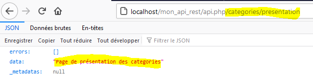
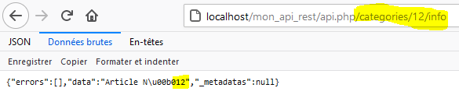
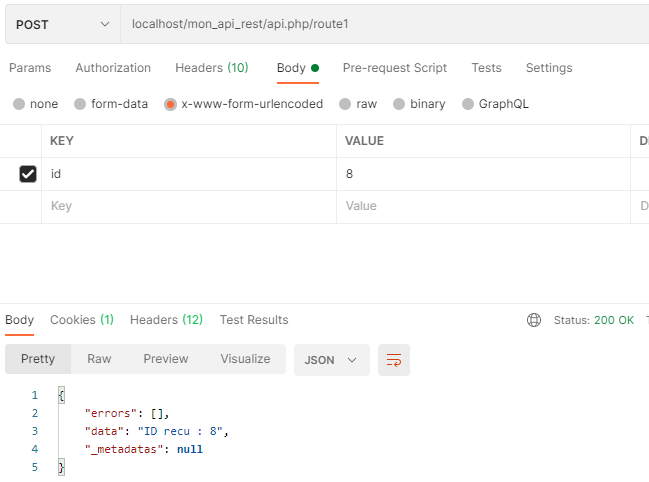

# Routage des API Restful - PHP PV

## Déclaration de routes

Vous devez déclarer les routes en réécrivant la méthode **ChargeRoutes()** de l'API Restful. Utilisez 2 méthodes :

- **InsereRouteParDefaut(\$route)** : Remplace la route par défaut
- **InsereRoute(\$nom, \$chemin, \$route)** : Inscrit une route dans l'API.

```php
class ApiRestful1 extends \Pv\ApiRestful\ApiRestful
{
// ...
protected function ChargeRoutes()
{
	// Route par défaut
	$this->InsereRouteParDefaut(new RouteAccueilRestful1()) ;
	// Route accessible /categories/presentation
	$this->InsereRoute("present_categ", "/categories/presentation", new RoutePresentCategRestful1()) ;
}
// ...
}
class RoutePresentCategRestful1 extends \Pv\ApiRestful\Route\Route
{
	protected function ExecuteInstructions()
	{
		$this->ContenuReponse->data = "Page de présentation des categories" ;
	}
}
```

Le lien de la route inscrite dans l'exemple est http://localhost/mon_api_rest/api.php/categories/presentation



Vous pouvez définir des variables en inscrivant une route, dans le paramètre **\$chemin**.

```php
	$this->InsereRoute("info_article", "/categories/{id_article}/info", new RouteInfoCategRestful1()) ;
```

Dans la route, vous avez accès à ces variables dans le tableau **$ApiParent->ArgsRouteAppelee**.

```php
class RouteInfoCategRestful1 extends \Pv\ApiRestful\Route\Route
{
	protected function ExecuteInstructions()
	{
		$this->ContenuReponse->data = "Article N°".$this->ApiParent->ArgsRouteAppelee["id_article"] ;
	}
}
```



## Route de Base

La classe de base est **\Pv\ApiRestful\Route\Route**. Réécrivez sa méthode **ExecuteInstructions()**.

```php
class Route1Restful1 extends \Pv\ApiRestful\Route\Route
{
protected function ExecuteInstructions()
{
$this->ContenuReponse->data = "Route 1" ;
}
}
```

## Caractéristiques de la requête

La requête reçue est disponible sur la propriété **\$Requete**. Ses membres importants sont :

Propriété/Méthode | Description
------------ | -------------
\$Methode | Méthode HTTP reçue
\$EnteteContentType | Type de contenu du document soumis
\$CheminRelatifRoute | Chemin de la route appelée
AttrEntete(\$nom, \$valeurDefaut=null) | Valeur de l'entête HTTP \$nom reçue.

```php
class Route1Restful1 extends \Pv\ApiRestful\Route\Route
{
protected function ExecuteInstructions()
{
if($this->Requete->Methode == "GET")
{
$this->ContenuReponse->data = "Methode GET Appelee" ;
}
else
{
$this->ContenuReponse->data = "Les autres methodes renvoient un autre contenu..." ;
}
}
```

Vous pouvez accéder au corps du message avec la propriété **\$CorpsBrut**.

```php
class Route1Restful1 extends \Pv\ApiRestful\Route\Route
{
protected function ExecuteInstructions()
{
$this->ConfirmeData("Contenu recu : ".$this->Requete->CorpsBrut) ;
}
}
```

Si vous recevez du contenu de type **application/json** ou **application/x-www-form-urlencoded**, vous aurez la propriété objet **$Corps** qui contient les paramètres.

```php
class Route1Restful1 extends \Pv\ApiRestful\Route\Route
{
protected function ExecuteInstructions()
{
$this->ConfirmeData("ID recu : ".$this->Requete->Corps->id) ;
}
}
```



## Personnalisation de la Réponse

Pour définir la contenu de la réponse, utilisez la propriété **\$ContenuReponse**.

```php
$this->ContenuReponse->data = "Route 1" ;
```
Pour changer le statut HTTP, vous avez plusieurs possibilités.

Propriété/Méthode | Description
------------ | -------------
RenseigneReponse(\$statusCode, \$message, \$data) | Renseigne le code HTTP, le message d'erreur, et la valeur de la réponse.
ConfirmeData(\$data) | Renseigne la valeur de l'API, et confirme le succès HTTP 200.
RenseigneErreur(\$message='') | Renseigne le message d'erreur, et renvoie l'erreur HTTP 400.
ConfirmeInvalide(\$message='') | Alias de RenseigneErreur(\$message='')
ConfirmeNonTrouve(\$message='') | Renseigne le message d'erreur, et renvoie l'erreur HTTP 404.
ConfirmeEchecAuth(\$message='') | Renseigne le message d'erreur, et renvoie l'erreur HTTP 403.
RenseigneException(\$message='') | Renseigne le message d'erreur, et renvoie l'erreur HTTP 500.
EstSucces() | Vérifie si la réponse actuelle a le statut HTTP 200
EstEchec() | Vérifie si la réponse actuelle n'a pas le statut HTTP 200

```php
class Route1Restful1 extends \Pv\ApiRestful\Route\Route
{
protected function ExecuteInstructions()
{
$this->RenseigneErreur("Page actuellement en construction") ;
}
}
```

Vous pouvez accéder à la réponse à partir de la propriété de l'API **\$Reponse**.

## Propriétés/méthodes spécifiques

Propriété/Méthode | Description
------------ | -------------
\$MethodeHttp | Nom de la méthode HTTP acceptée. Par défaut, possède la valeur vide la route accepte tout.
\$ApiParent | Api contenant la route.
\$NomElementApi | Nom de la route dans l'API
\$CheminRouteApi | Chemin de la route déclarée sur l'API.

```php
class Route1Restful1 extends \Pv\ApiRestful\Route\Route
{
public $MethodeHttp = "GET" ; // Acceptera uniquement la méthode GET
protected function ExecuteInstructions()
{
	$this->ContenuReponse->data = "Route appelée sous le nom ".$this->NomElementApi ;
}
}
```

## Exécution de la route

Vous pouvez réécrire 3 méthodes pour personnaliser l'exécution d'une route :

- PrepareExecution()
- ExecuteInstructions()
- TermineExecution()

Utilisez la propriété bool **\$ArreterExecution** pour terminer l'exécution.

```php
class Route1Restful1 extends \Pv\ApiRestful\Route\Route
{
protected function PrepareExecution()
{
$this->ResFic = fopen("mon_fichier.txt", "r") ;
if(! $this->ResFic)
{
$this->RenseigneErreur("Fichier mon_fichier.txt introuvable") ;
$this->ArreterExecution = true ;
}
}
protected function ExecuteInstructions()
{
	$this->ContenuReponse->data = "Contenu fichier : ".fgets($this->ResFic) ;
}
protected function TermineExecution()
{
fclose($this->ResFic)
}
}
```

## Autres liens

- [La route Collection](collection.md)
- [La route Individuelle](individuel.md)