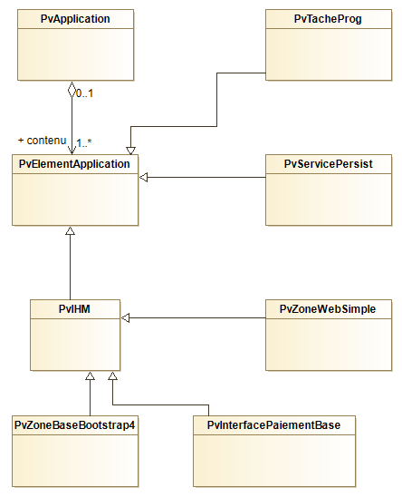
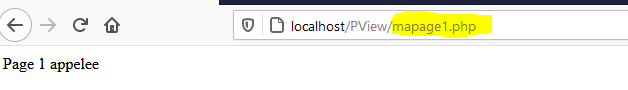
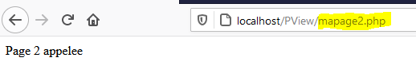

# La classe Application - PHP-PV

## Présentation

L'Application dans PHP-PV contient toutes les interfaces exécutables (zone web, tache programmée...).



## Méthodes principales

Nom | Contexte | Description
------------ | ------------- | -------------
InitConfig() | A réécrire | Définit les membres à l’instanciation de l’application
Execute() | A partir d’une instance | Exécute l’application
ChargeConfig() | A réécrire. Invoquée par Execute(). | Définit les membres pour l’exécution de l’application.
ChargeIHMs() | A réécrire. Invoquée par ChargeConfig() | Définit les Interfaces (Web, Console, SOAP, …) de l’application
ChargeTachesProgs() | A réécrire. Invoquée par ChargeConfig() | Invoquée par la méthode ChargeConfig().Définit les tâches programmées de l’application.
ChargeServsPersists() | A réécrire. Invoquée par ChargeConfig() | Invoquée par la méthode ChargeConfig()
InsereIHM(string $nom, & \Pv\IHM\IHM $ihm) | Utiliser dans ChargeIHMs() | Inscrit une IHM (Interface web, console ou SOAP) dans l’application
InsereTacheProg(string $nom, & \Pv\TacheProg\TacheProg $tacheProg) | Utiliser dans ChargeTachesProgs() | Inscrit une tâche programmée dans l’application
InsereServPersist(string $nom, & \Pv\ServicePersist\ServicePersist $servPersist) | Utiliser dans ChargeServsPersists() | Inscrit un service persistant dans l’application

```php
class MonApplication1 extends \Pv\Application\Application
{
protected function InitConfig()
{
parent::InitConfig() ;
$this->Var1 = 1 ;
}
public function ChargeIHMs()
{
$this->InsereIHM("zone1", new MaZone1()) ;
}
}
$app = new MonApplication1() ;
$app->Execute() ;
```

## L'élement d’application

### Présentation

L’élément d’application est la classe **\Pv\Application\Element**. Elle est le noyau des interfaces web, console, SOAP, services et tâche programmée.

Plusieurs classes héritent de **\Pv\Application\Element** :

Classe | Description
------------- | -------------
\Pv\IHM\IHM | Classe de base pour toutes les Interfaces (Web, console, Restful...)
\Pv\TacheProg\TacheProg | Classe de base pour toutes les tâches programmées (Web, console...)
\Pv\ServicePersist\ServicePersist | Classe de base pour tous les services persistants  (Web, console...)

### Utilisation

Quand l’application s’exécute, elle parcourt tous ses éléments d’application. Si l’un d’entre eux est actif, l’application démarre l’exécution de cet élément et arrête le parcours.
Pour savoir si un élément d’application est actif, l’application a deux possibilités :
- Vérifier si le chemin relatif de l’élément est celui du script PHP. La propriété est **CheminFichierRelatif**.
- La propriété **AccepterTousChemins** de cet élément a pour valeur **1**.

Exemple :
Mettez ce code source dans le fichier **mapage1.php**.
```php
// Classe MaPage1, à enregistrer dans mapage1.php
class MaPage1 extends \Pv\IHM\IHM
{
public $CheminFichierRelatif = "mapage1.php" ;
public function Execute()
{
echo "Page 1 appelee" ;
}
}
class MaPage2 extends \Pv\IHM\IHM
{
public $AccepterTousChemins = 1 ;
public function Execute()
{
echo "Page 2 appelee" ;
}
}
class MonApplication1 extends \Pv\Application\Application
{
public function ChargeIHMs()
{
$this->Page1 = $this->InsereIHM("page1", new MaPage1()) ;
$this->Page2 = $this->InsereIHM("page2", new MaPage2()) ;
}
}
```
Créez ensuite un fichier **mapage2.php** qui inclut **mapage1.php**.
```php
include dirname(__FILE__)."/mapage1.php" ;
```

Chaque classe affichera en fonction du fichier PHP appelé.





### Propriétés / Méthodes principales

Propriété | Description
------------- | -------------
$ApplicationParent | Accède à l'application contenant
$NomElementApplication | Nom de l'élément dans l'application

```php
class MaPage2 extends \Pv\IHM\IHM
{
public $AccepterTousChemins = 1 ;
public function Execute()
{
echo "Page 2 appelee sous le nom <b>".$this->NomElementApplication."</b>" ;
}
}
```

### Filtrage d'accès

Veuillez réecrire la méthode **EstActif(\$cheminFichierAbsolu, \$cheminFichierElementActif)** pour filtrer l'accès à l'élément d'application.

```php
class MonInterfaceWeb extends \Pv\IHM\IHM
{
public function EstActif($cheminFichierAbsolu, $cheminFichierElementActif)
{
$ok = parent::EstActif($cheminFichierAbsolu, $cheminFichierElementActif) ;
if(! $ok)
{
return $ok ;
}
return php_sapi_name() != "CLI" ;
}
```

> Dans cet exemple, le script sera affiché s'il est exécuté sur un serveur web ou CGI.

## Voir aussi

- [La zone web](zoneweb/zoneweb.md)
- [Méthodes principales](mtdsprincs.md)
- [Les passerelles de paiement](passerellepaiement.md)
- [Les services persistants](servicespersistants.md)
- [Les tâches programmées](tachesprogs.md)
- [Index](index.md)
