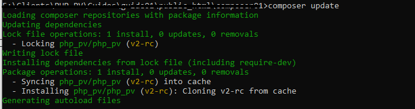

# Configuration PHP-PV

**PHP-PV** fonctionne en mode CLI et WEB.

## Installation avec composer

Vous pouvez inclure directement la branche GITHUB avec composer. Procédez ainsi, en inscrivant dans les tags du fichier **composer.json**.

1. Dans **repositories** :

```json
{
	"type":"package",
	"package": {
	  "name": "php_pv/php_pv",
	  "version":"master",
	  "source": {
		  "url": "https://github.com/PvSolutions/php-pv.git",
		  "type": "git",
		  "reference":"master"
		}
	}
}
```

2. Dans **require** :

```json
"php_pv/php_pv": "master"
```

3. Dans **autoload**, ajoutez les clés "psr-4" et "files", avec ces contenus :

```json
"psr-4": {,
	// Autres psr-4...
	"Pv\\": "vendor/php_pv/php_pv/src/"
}
```

Exemple :

```json
{
    "name": "macompagnie/solution1_program",
    "type": "project",
    "description": "Programme de la solution 1",
    "license": "proprietary",
	"repositories": [
		{
			"type":"package",
			"package": {
			  "name": "php_pv/php_pv",
			  "version":"master",
			  "source": {
				  "url": "https://github.com/PvSolutions/php-pv.git",
				  "type": "git",
				  "reference":"master"
				}
			}
		}
	],
	"require": {
		"php_pv/php_pv": "master"
	},
	"autoload": {
        "psr-4": {
			"Pv\\": "vendor/php_pv/php_pv/src/"
		}
    }
}
```

Exécutez **composer update** pour installer l'autoloader.

```shell
composer update
```



Créez un fichier **hellopv.php** dans le répertoire du projet, et testez :

```php
// Inclure l'autoloader composer
include dirname(__FILE__)."/vendor/autoload.php" ;
// Définir la classe de l'application
class ApplicationHelloPV extends \Pv\Application\Application
{
	protected function ChargeIHMs()
	{
		$this->ZonePrinc = $this->InsereIHM("zonePrinc", new ZonePrincHelloPV()) ;
	}
}
class ZonePrincHelloPV extends \Pv\ZoneWeb\ZoneWeb
{
	public $AccepterTousChemins = 1 ;
	protected function ChargeScripts()
	{
		$this->ScriptAccueil = $this->InsereScriptParDefaut(new ScriptAccueilHelloPV) ;
	}
}
class ScriptAccueilHelloPV extends \Pv\ZoneWeb\Script\Script
{
	protected function RenduDispositifBrut()
	{
		return '<h1>HELLO WORLD</h1>' ;
	}
}
// Exécuter l'application
$app = new ApplicationHelloPV() ;
$app->Execute() ;
```


## Installation en local

### Téléchargement

Veuillez télécharger la dernière version sur https://github.com/PvSolutions/php-pv/archive/master.zip.

### Installation sur serveur web

Décompressez le contenu à la racine du dossier www du serveur web.

## Installation en mode CLI

Décompressez le contenu dans n'importe quel répertoire.

### Vérification

Veuillez inclure le fichier **/php-pv-master/autoload.php** pour le chargement des classes.

Créez un fichier **hellopv.php** au même niveau que le dossier **php-pv-master**, pour les tests

```php
// Inclure la librairie
include dirname(__FILE__)."/php-pv-master/autoload.php" ;
// Définir la classe de l'application
class ApplicationHelloPV extends \Pv\Application\Application
{
	protected function ChargeIHMs()
	{
		$this->ZonePrinc = $this->InsereIHM("zonePrinc", new ZonePrincHelloPV()) ;
	}
}
class ZonePrincHelloPV extends \Pv\ZoneWeb\ZoneWeb
{
	public $AccepterTousChemins = 1 ;
	protected function ChargeScripts()
	{
		$this->ScriptAccueil = $this->InsereScriptParDefaut(new ScriptAccueilHelloPV) ;
	}
}
class ScriptAccueilHelloPV extends \Pv\ZoneWeb\Script\Script
{
	protected function RenduDispositifBrut()
	{
		return '<h1>HELLO WORLD</h1>' ;
	}
}
// Exécuter l'application
$app = new ApplicationHelloPV() ;
$app->Execute() ;
```
Résultat :


## Voir aussi

- [Premier projet](premierprojet.md)
