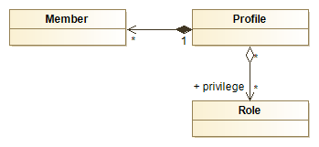
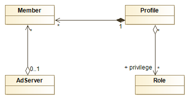

# Le service d'authentification - PHP-PV

## Fonctionnement

Le Membership est le service d’authentification dans la zone.
Il se base sur les modèles relationnels suivants :

- Sans Support LDAP :



- Avec Support LDAP :



Pour l’installer, vous devez créer une base de données et les tables nécessaires.
Vous trouverez les scripts SQL dans le code source :

Fichier | Description
------------- | -------------
install-membership-pv-mysql.sql | Tables de membership pour MySQL
install-membership-pv-mysql-ad.sql | Tables de membership pour MySQL, avec authentification Active Directory
install-membership-pv-orcl.sql | Tables de membership pour Oracle
install-membership-pv-orcl-ad.sql | Tables de membership pour Oracle, avec authentification Active Directory

## Déclaration

Tout service d’authentification doit hériter de la classe **\Pv\Membership\Sql**.

```php
// 1. Déclarer la base de données
class MaBD extends \Pv\DB\Native\Mysql
{
}

// 2. Déclarer le Membership
class MonMembership extends \Pv\Membership\Sql
{
protected function InitConfig(& $parent)
{
parent::InitConfig($parent) ;
// Affecter la base de données du Membership
$this->Database = new MaBD() ;
}
}

class MaZone1 extends \Pv\ZoneWeb\ZoneWeb
{
// ...
// 3. Affecter le membership à la Zone
Public $NomClasseMembership = "MonMembership" ;
}
```

## Propriétés et méthodes principales

Propriété/Méthode | Description
------------- | -------------
$Database | Base de données qui contient les tables de membership. Type accepté : **CommonDB**.
$RootMemberId | ID Membre du super administrateur
$GuestMemberId | ID Membre de l’invité
$MemberTable | Nom de la table des membres dans la base de données
$ProfileTable | Nom de la table des profils dans la base de données
$RoleTable | Nom de la table des rôles dans la base de données
$PrivilegeTable | Nom de la table des privilèges dans la base de données
$SessionSource | Source de la session.
$SessionMemberKey | Clé de la session PHP ($_SESSION) qui contient l’ID du membre connecté
LogonMember($memberId) | Connecte l’ID du Membre dans la session
LogoutMember($memberId) | Déconnecte l’ID du Membre dans la session
ValidateConnection($login, $password) | Vérifie si les accès du membre sont corrects

```php
class MonMembership extends \Pv\Membership\Sql
{
public $MemberTable = "tuto_membre" ;
public $ProfileTable = "tuto_profile" ;
public $PrivilegeTable = "tuto_privilege" ;
public $RoleTable = "tuto_role" ;
public $GuestMemberId = 2 ;
}
```

## Gestion de la session

Lorsqu'un utilisateur se connecte, son identifiant est stocké dans une variable session. L'origine du stockage est défini dans **$SessionSource**. Ses valeurs possibles sont :
- "SESSION" : variable $_SESSION (par défaut)
- "COOKIE" : variable $_COOKIES

```php
class MonMembership extends \Pv\Membership\Sql
{
public $SessionSource = "COOKIE" ;
}
```

La clé de la variable session est défini dans **$SessionMemberKey**. Par défaut, c'est "login".

```php
class MonMembership extends \Pv\Membership\Sql
{
public $SessionMemberKey = "id_membre_connecte" ;
}
```

## Structure des tables

### Table des membres

Colonne | Propriété classe Membership | Description
------------- | ------------- | -------------
id | $IdMemberColumn | ID (autoincrément) du membre créé
login_member | $LoginMemberColumn | Nom d'utilisateur de connexion
password_member | $PasswordMemberColumn | Mot de passe de connexion 
email | $EmailMemberColumn | Email
first_name | $FirstNameMemberColumn | Prénom
last_name | $LastNameMemberColumn | Nom
address | $AddressMemberColumn | Adresse
contact | $ContactMemberColumn | Contact
enabled | $EnabledMemberColumn | Est activé
profile_id | $ProfileMemberColumn | ID du profil

Exemple PHP :
```php
class MonMembership extends \Pv\Membership\Sql
{
public $ContactMemberColumn = "numero_telephone" ;
}
```

Exemple SQL :
```sql
// Sélectionner le id,login à partir d'un email
select id, login_member where email='xxxxx@xxx.xx' ;
```

### Table des profils

Colonne | Propriété classe Membership | Description
------------- | ------------- | -------------
id | $IdProfileColumn | ID (autoincrément) du profil créé
title | $TitleProfileColumn | Titre
description | $DescriptionProfileColumn | Description
enabled | $EnableProfileColumn | Activé

Exemple PHP :
```php
class MonMembership extends \Pv\Membership\Sql
{
public $DescriptionProfileColumn = "sommaire" ;
}
```

Exemple SQL :
```sql
// Sélectionner à partir de l'ID 3
select * from membership_profile where id=3 ;
```

### Table des roles

Colonne | Propriété classe Membership | Description
------------- | ------------- | -------------
id | $IdRoleColumn | ID (autoincrément) du rôle créé
code | $NameRoleColumn | Code du rôle
title | $TitleRoleColumn | Titre
description | $DescriptionRoleColumn | Description
enabled | $EnableRoleColumn | Activé

Exemple PHP :
```php
class MonMembership extends \Pv\Membership\Sql
{
public $TitleRoleColumn = "nom" ;
}
```

Exemple SQL :
```sql
// Sélectionner à partir d'un code
select * from membership_role where name='gestion_fournisseurs' ;
```

### Table des privileges

Colonne | Propriété classe Membership | Description
------------- | ------------- | -------------
id | $IdPrivilegeColumn | ID (autoincrément) du rôle créé
profile_id | $ProfilePrivilegeColumn | ID du profil
role_id | $RolePrivilegeColumn | ID du rôle
active | $EnablePrivilegeColumn | Activé

Exemple PHP :
```php
class MonMembership extends \Pv\Membership\Sql
{
public $EnablePrivilegeColumn = "active" ;
}
```

Exemple SQL :
```sql
// Tous les rôles d'un profil
select t1.*, t3.*, t2.active role_active
from membership_profile t1
inner join membership_privilege t2 on t1.id = t2.profile_id
inner join membership_role t3 on t3.id = t2.role_id
where t1.id=1 ;
```

## Inscription de colonnes SQL

Vous pouvez ajouter directement des colonnes dans la table des membres.

```sql
alter table membership_member add numero_telephone varchar(8) null ;
alter table membership_member add date_inscription date null ;
```

Ces colonnes doivent être déclarées dans **ExtraColsAllMembers()**. La liste des champs doit être précéde de ", ".

```php
protected function ExtraColsAllMembers()
{
return ', numero_telephone, date_inscription' ;
}
```

## Connexion par email

Activez la connexion par email avec la propriété **$LoginWithEmail**.

```php
class MonMembership extends \Pv\Membership\Sql
{
$LoginWithEmail = true ;
}
``` 

Les impacts sur la table **membership_member** sont :
- la colonne **login_member** contiendra les emails
- la colonne **email** n'est plus utilisée

## Voir aussi

- [Les bases de données](commondb.md)
- [Les scripts Membership](zoneweb/scriptsmembership.md)
