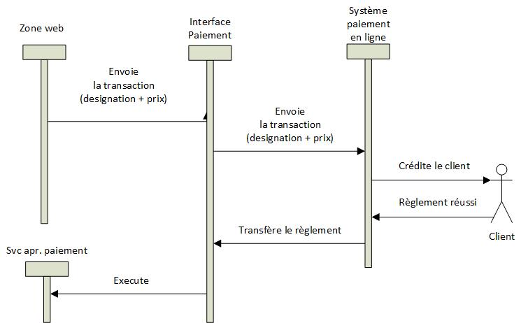

# Passerelles de paiement - PHP-PV

## Présentation

La passerelle de paiement est une IHM de l'application, pour payer des services de l'application (facture, article etc).
Elle se connecte sur un système de paiement en ligne.
Exemple :
Paypal, Skrill...
Une fois le paiement réussi, elle affecte le service demandé avec le client.

## Processus



A partir d'une zone web, vous soumettez une transaction à la passerelle de paiement.
Elle contactera le système de paiement en ligne. Une fois le paiement réussi, la passerelle exécute le service après paiement.

## Passerelle de paiement Test (Assistance)

### Préparation

Les passerelles de paiement enregistrent les transactions dans une base de données MySQL.

Vous devez télécharger à cette adresse :

(https://github.com/PvSolutions/php-pv/blob/sql/Paiement/transaction_paiement.sql)

Importez le script dans votre base de données. Il crée une table "transaction_paiement"

### Utilisation

1. Déclarez la base de données des transactions. Seules les BD MariaDB et Mysql sont supportées.

```php
class BdTransact1 extends \Pv\DB\PDO\Mysql
{
public function InitConnectionParams()
{
parent::InitConnectionParams() ;
$this->ConnectionParams["server"] = "localhost" ;
$this->ConnectionParams["user"] = "user" ;
$this->ConnectionParams["password"] = "pass" ;
$this->ConnectionParams["schema"] = "mabd1" ;
}
}
```

2. Déclarez la base de données des informations de paiement

Téléchargez à cette adresse, la structure SQL de la passerelle test.

(https://github.com/PvSolutions/php-pv/blob/sql/Paiement/Assistance/Install.sql)

Importez le script dans votre base de données. Il crée une table "assistance_paiement".

Déclarez la classe Base de données MySQL.

```php
class BdAssistance1 extends \Pv\DB\PDO\Mysql
{
public function InitConnectionParams()
{
parent::InitConnectionParams() ;
$this->ConnectionParams["server"] = "localhost" ;
$this->ConnectionParams["user"] = "root" ;
$this->ConnectionParams["password"] = "xxxxx" ;
$this->ConnectionParams["schema"] = "mabd1" ;
}
}
```

3. Déclarez le service après paiement, pour une transaction réussie

```php
class ServicePaye1 extends \Pv\InterfPaiement\ServiceVendu
{
public function ConfirmeSucces(& $transaction) // Si la transaction aboutit
{
echo "BRAVO ! Paiement reussi !!!" ;
}
public function ConfirmeEchec(& $transaction) // Si la transaction echoue
{
echo "Désolé, votre transaction a échoué !!!" ;
}
public function Annule(& $transaction) // Si la transaction est annulee
{
echo "Désolé, vous avez annulé votre transaction !!!" ;
}
}
```

4. Déclarez la passerelle de paiement.

```php
class MaPasserellePaie1 extends \Pv\InterfPaiement\Assistance\Assistance
{
// Base de données transactions
protected function CreeBdTransaction()
{
return new BdTransact1() ;
}
}
```

5. Insérez cette passerelle et assignez le service après paiement dans l'application

```php
class Application1 extends \Pv\Application\Application
{
public function ChargeIHMs()
{
$this->PasserellePaie1 = $this->InsereIHM("passerelle1", new MaPasserellePaie1()) ;
// ...
}
// déclarez le service après paiement
public function ChargeConfig()
{
parent::ChargeConfig() ;
$this->InsereServiceVendu("service1", new ServicePaye1()) ;
}
}
```

6. Dans une zone, demandez le paiement.

```php
class MaZone1 extends \Pv\ZoneWeb\ZoneWeb
{
protected function ChargeScripts()
{
$this->InsereScriptParDefaut(new MonScript1()) ;
}
}
class MonScript1 extends \Pv\ZoneWeb\Script\Script
{
// ....
// Accédez à la passerelle de paiement
$passerellePaie = & $this->ApplicationParent->PasserellePaie1 ;
// Initier une transaction
$transaction = $passerellePaie->Transaction() ;
$transaction->Montant = 20 ;
$transaction->Monnaie = 'EUR' ; // EURO
$transaction->Designation = "Paiement du produit AAAA" ;
$transaction->Cfg->NomServiceVendu = "monService1" ; // Nom du service après paiement
$transaction->Cfg->Arg01 = $this->ZoneParent->IdMembreConnecte() ;
// Démarrer le processus
$passerellePaie->DemarreProcessus() ;
// ...
}
```

## Références dans l'Application

Les passerelles de paiement sont des IHMs dans l'application. Intégrez les avec la méthode **InsereInterfPaiement()** au lieu de **InsereIHM()**.

```php
class MonApp extends \Pv\Application\Application
{
protected function ChargeIHMs()
{
$this->Zone1 = $this->InsereIHM("zone1", new MaZone1) ;
$this->PassPaie1 = $this->InsereInterfPaiement("passPaie1", new MaPassPaie1) ;
}
}
```

Propriété / Méthode | Description
------------ | -------------
$NomsInterfsPaiement | Contient les noms des passerelles de paiement
InterfsPaiement() | Renvoie les passerelles de paiement
InterfPaiement($nom) | Retourne la passerelle de paiement nommée **$nom**.
ExisteInterfPaiement($nom) | Vérifie s'il existe une passerelle de paiement **$nom**.

```php
class MonScript extends \Pv\ZoneWeb\Script\Script
{
public function DetermineEnvironnement()
{
if(isset($_GET["payerPar"]))
{
$nomPassPaie = $_GET["payerPar"] ;
if($this->ApplicationParent->ExisteInterfPaiement($nomPassPaie))
{
$passPaie = $this->ApplicationParent->InterfPaiement($nomPassPaie) ;
//...
}
}
}
public function RenduSpecifique()
{
$ctn = '' ;
$ctn '<p>Veuillez choisir votre moyen de paiement :</p>' ;
$interfsPaie = $this->ApplicationParent->InterfsPaiement() ;
foreach($interfsPaie as $i => $passPaie)
{
	echo '<p>- <a href="?payerPar='.$passPaie->NomElementApplication.'">'.$passPaie->Titre.'</a></p>'."\n" ;
}
return $ctn ;
}
}
```

## Caractéristiques service après paiement

Vous accédez à l'arborescence de la passerelle avec ces propriétés :

- **InterfPaiemtParent** : Passerelle de paiement contenant ce service
- **ApplicationParent()** : Application racine

```php
class ServicePaye1 extends \Pv\InterfPaiement\ServiceVendu
{
public function ConfirmeSucces(& $transaction) // Si la transaction aboutit
{
	$interfParent = & $this->InterfPaiemtParent ;
	$app = $this->ApplicationParent() ;
	echo "<p>BRAVO ! Paiement reussi sur ".htmlentities($app->Titre)." !!!</p>" ;
}
}
```

Vous avez aussi la propriété **NomElementInterfPaiemt**, retournant le nom du service dans la passerelle.

## Passerelle de paiement PAYPAL

Elle permet d'effectuer les paiements par PAYPAL (www.paypal.com).

### Pré-requis SQL

Téléchargez et importez le fichier dans votre base de données MySQL :

https://github.com/PvSolutions/php-pv/blob/sql/Paiement/Paypal/install.sql

### Déclaration de la classe

Rendez-vous sur le site www.paypal.com.

Connectez-vous avec un compte business.
Créez un nouveau service pour obtenir le Client ID et le Secret.

Avec ces informations, déclarez votre classe.

```php

// Déclarez la classe
class PassPaie1 extends \Pv\InterfPaiement\Paypal\Paypal
{
public $ClientIdCompteMarchand = "<Mon Client ID>" ; // mettre le Client ID
public $SecretCompteMarchand = "<Mon secret>" ; // mettre le Secret
protected function CreeBdTransaction() // Définissez la classe BD qui contient les transactions
{
return new MaBD() ;
}
}
```

### Présentation web de la transaction en cours

Cette passerelle affiche au milieu de l'écran les boutons de paypal. Le client clique sur l'un de ces boutons pour accéder à Paypal.

Si vous voulez changer l'allure de cette page, réécrivez les méthodes **RenduEnteteDocument()**, **RenduEnteteCorpsDocument()**, **RenduPiedCorpsDocument()**, **RenduPiedDocument()**.

```php
class PassPaie1 extends \Pv\InterfPaiement\Paypal\Paypal
{
public $MsgSoumetFormPaiement = "Cliquez sur le bouton en dessous pour payer" ; // Message avant les boutons paypal
// ...
// Contenu HTML jusqu'au <body>
protected function RenduEnteteDocument()
{
// Contenu original
return '<!doctype html>
<html lang="en">
<head>
<meta charset="utf-8">
<title>'.$this->TitreSoumetFormPaiement.'</title>
<meta http-equiv="X-UA-Compatible" content="IE=edge" />
<meta name="viewport" content="width=device-width, initial-scale=1">
</head>
<body align="center">' ;
}
// Contenu HTML avant le code généré pour Paypal
protected function RenduEnteteCorpsDocument()
{
return '' ;
}
// Contenu HTML après le code généré pour Paypal
protected function RenduPiedCorpsDocument()
{
return '' ;
}
// Contenu HTML à partir de </body>
protected function RenduPiedDocument()
{
// Contenu original
return '</body>
</html>' ;
}
// ...
}
```

## Passerelle de paiement SKRILL

Elle permet d'effectuer les paiements par SKRILL (www.skrill.com).

### Pré-requis SQL

Téléchargez et importez le fichier dans votre base de données MySQL :

https://github.com/PvSolutions/php-pv/blob/sql/Paiement/Skrill/install.sql

### Déclaration de la classe

Rendez-vous sur le site www.skrill.com.

Connectez-vous avec un compte business.

Déclarez votre classe.

```php
// Déclarez la classe
class PassPaie1 extends \Pv\InterfPaiement\Skrill\Skrill
{
public $EmailBenefCompteMarchand = "<Mon Email Skrill>" ; // mettre l'email
protected function CreeBdTransaction() // Définissez la classe BD qui contient les transactions
{
return new MaBD() ;
}
}
```

## Passerelle de paiement CINETPAY

Elle permet d'effectuer les paiements par CINETPAY (www.cinetpay.com). Cette solution est disponible pour les résidents de l'Afrique de l'Ouest.

### Pré-requis SQL

Téléchargez et importez le fichier dans votre base de données MySQL :

https://github.com/PvSolutions/php-pv/blob/sql/Paiement/Cinetpay/structure.sql

### Déclaration de la classe

Rendez-vous sur le site www.cinetpay.com.

Connectez-vous avec un compte marchand.
Créez un nouveau service pour obtenir le API Key et le Site Id.

Avec ces informations, déclarez votre classe.

```php
// Déclarez la classe
class PassPaieCinetpay1 extends \Pv\InterfPaiement\Cinetpay\Cinetpay
{
public $ApiKeyCompteMarchand = "mon_api_key" ; // mettre le API Key
public $SiteIdCompteMarchand = "mon_site_id" ; // mettre le Site ID
protected function CreeBdTransaction() // Définissez la classe BD qui contient les transactions
{
return new MaBD() ;
}
}
```

## Passerelle de paiement COINSPAYMENT

Elle permet d'effectuer les paiements par COINSPAYMENT (https://www.coinpayments.net/).

### Pré-requis SQL

Téléchargez et importez le fichier dans votre base de données MySQL :

https://github.com/PvSolutions/php-pv/blob/sql/Paiement/CoinPayments/install.sql

### Déclaration de la classe

Rendez-vous sur le site https://www.coinpayments.net/.

Connectez-vous avec un compte Business, et obtenez vos identifiants Merchant et IPNSecret.

Avec ces informations, déclarez votre classe.

```php
// Déclarez la classe
class PassPaieCoinsPayment1 extends \Pv\InterfPaiement\CoinPayments\CoinPayments
{
public $MerchantCompteMarchand = "mon merchant" ; // Mettre la valeur du merchant
public $IPNSecretCompteMarchand = "MyIPN Secret" ; // Mettre la valeur du IPN Secret
protected function CreeBdTransaction() // Définissez la classe BD qui contient les transactions
{
return new MaBD() ;
}
}
```

## Passerelle de paiement personnalisée

### Pré-requis SQL

Vous pouvez faire votre passerelle pour un système de paiement mobile ou internet.

D'abord, identifiez les détails d'une transaction à sauvegarder. Voici quelques informations :

- le montant
- la date d'initiation de la demande au système de paiement
- la date retour de la demande au système de paiement
- les frais
- le contenu HTTP envoyé pour chaque appel
- le contenu HTTP reçu pour chaque appel
- la référence de la transaction

### Déclaration de la classe

Votre passerelle doit hériter de la classe **\Pv\InterfPaiement\InterfPaiement**.

```php
class MaPasserellePaiePerso extends \Pv\InterfPaiement\InterfPaiement
{
public $IdentifiantMarchand1 ;
public $IdentifiantMarchand2 ;
}
```

### Envoi de transaction au système en ligne

Réécrivez la méthode **PrepareTransaction()** pour vérifier si le système de paiement en ligne acceptera votre transaction. En cas de réponse positive, marquez l'état de l'exécution à **"verification_ok"**.

Inscrivez les détails de la transaction en ligne à ce niveau.

```php
protected function PrepareTransaction()
{
// Vérifier si le paiement est possible
...
// Sauvegarde des traces dans la base de données
$ok = $bd->RunSql(
	"insert into transaction_spec(id_transaction, date_creation, valeur_verif) values (:id_transaction, NOW(), :valeur_verif)",
	array("id_transaction" => $this->_Transaction->IdTransaction, "valeur_verif" => "1")
) ;
// Confirmer quand la préparation a réussi
if($ok)
{
$this->DefinitEtatExecution("verification_ok") ;
}
else
{
$this->DefinitEtatExecution("verification_echoue") ;
}
}
```

Enfin, Envoyez de la transaction au système en ligne en réécrivant la méthode **SoumetTransaction()**

```php
// Soumet la transaction au système de paiement
// si la vérification a réussi
protected function SoumetTransaction()
{
}
```

Pour les systèmes de paiement qui demandent les liens de retour, utilisez ces méthodes :

- **UrlTermine()** : URL de la passerelle pour recevoir le règlement de la transaction
- **UrlAnnule()** : URL de la passerelle pour annuler le règlement de la transaction

```php
// Soumet la transaction au système de paiement
// si la vérification a réussi
protected function SoumetTransaction()
{
echo '<form action="https://api_lien_externe" method="post">
<input type="hidden" name="mm_trans_id" value="'.$this->_Transaction->IdTransaction.'" />
<input type="hidden" name="mm_amount" value="'.$this->_Transaction->Montant.'" />
<input type="hidden" name="mm_currency" value="'.htmlspecialchars($this->_Transaction->Monnaie).'" />
<input type="hidden" name="mm_label" value="'.htmlspecialchars($this->_Transaction->Designation).'" />
<input type="hidden" name="mm_return_url" value="'.$this->UrlTermine().'" />
<input type="hidden" name="mm_cancel_url" value="'.$this->UrlAnnule().'" />
</form>'
}
```

### Statuts des règlements

Vous pouvez mettre une API pour recevoir l'évolution d'un paiement soumis.

Votre API le recevra à partir du paramètre GET **resultat**.

```
?resultat=maj_statut
```

Pour ce faire, réécrivez **DetermineResultatPaiement()**. Examinez la valeur **$_GET[$this->NomParamResultat]**.

```php
protected function DetermineResultatPaiement()
{
// Conserver les vérifications précédentes
parent::DetermineResultatPaiement() ;
// Inclure votre vérification
if($this->ValeurParamResultat == '' && isset($_GET[$this->NomParamResultat]))
{
if($_GET[$this->NomParamResultat] == "maj_statut")
{
$this->ValeurParamResultat = "maj_statut" ;
// Traiter les informations de la transaction
$etat = $_POST["status"] ;
// ...
}
}
}
```

Si la transaction est en cours de traitement sur le système de paiement en ligne, confirmez en définissant la méthode **TransactionEnCours()**.

```php
// Confirmer que la transaction est toujours en cours
protected function TransactionEnCours()
{
return ($this->ValeurParamResultat == "maj_statut") ;
}
```

### Réception du règlement de la transaction

Lorsque le client quitte le système de paiement en ligne, vous pouvez définir le succès/échec du réglement en utilisant le lien **"?resultat=termine"**. 

Réécrivez la méthode **RestaureTransactionEnCours()**.

```php
protected function RestaureTransactionEnCours()
{
parent::RestaureTransactionEnCours() ;
// Le systeme de paiement a renvoyé les resultats
if($this->IdEtatExecution() == "termine")
{
// Traiter les résultats reçus.
if($_POST["status_code"] === 200)
{
// Paiement réussi
$this->DefinitEtatExecution("paiement_reussi") ;
// Mettre à jour la transaction dans la base de données
// ...
}
else
{
// Paiement échoué
$codeErr = $_POST["status_code"] ;
$msgErr = $_POST["status_message"] ;
$this->DefinitEtatExecution("paiement_echoue", $codeErr.": ".$msgErr) ;
// Mettre à jour la transaction dans la base de données
// ...
}
}
// Le systeme de paiement a annulé la transaction
elseif($this->IdEtatExecution() == "annule")
{
// Traiter la transaction comme annulée
// Mettre à jour la transaction dans la base de données
// ...
}
}
```

## Voir aussi

- [L'Application](application.md)
- [La zone web](zoneweb/zoneweb.md)
- [Index](index.md)