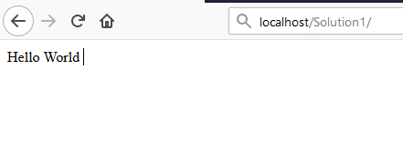

# Mon premier projet

## Création du dossier solution

Téléchargez le code source de PHP-PV sur GITHUB. Décompressez le fichier **php-pv-master.zip**. Copiez le contenu du dossier **php-pv-master** à la racine de votre site web **/**
Vous allez créer un dossier **Solution1** pour votre solution, au même niveau que le dossier **php-pv-master**. 

Ainsi, vous aurez :

```
/php-pv-master
/Solution1
	index.php
```	

Ensuite, créez un fichier index.php dans le dossier **Solution1**.
Comme première instruction, incluez le fichier « **../php-pv-master/autoload.php** »

```php
<?php
include dirname(__FILE__)."/../php-pv-master/autoload.php" ;
```

## Déclaration de l’application

Dans ce fichier PHP, déclarez votre classe **ApplicationSolution1**, qui héritera de la classe **\Pv\Application\Application**.

```php
class ApplicationSolution1 extends \Pv\Application\Application {
}
```

## Déclaration de la zone Web

Juste après, déclarez la zone web.

```php
class ZoneWebSolution1 extends \Pv\ZoneWeb\ZoneWeb {
	// Forcer l’affichage de la zone web, sans tenir compte du chemin du script
public $AccepterTousChemins = 1 ;
}
```

Retournez dans votre classe **ApplicationSolution1**, réécrivez la méthode **ChargeIHMs()**. Vous invoquerez la méthode **InsereIHM()** pour inscrire la Zone Web.

```php
class ApplicationSolution1 extends \Pv\Application\Application {
protected function ChargeIHMs() {
$this->InsereIHM("zoneWeb", new ZoneWebSolution1()) ;
}
}
```

## Déclaration du script par défaut

Créez maintenant un script web, qui affichera « Hello World ».
Ce script héritera de la classe **\Pv\ZoneWeb\Script\Script**. Réécrivez sa méthode **RenduSpecifique()** pour retourner le texte à afficher.

```php
class ScriptAccueilSolution1 extends \Pv\ZoneWeb\Script\Script {
	public function RenduSpecifique() {
		return "Hello World" ;
	}
}
```

Maintenant réécrivez la méthode **ChargeScripts()** de la zone web au-dessus. Utilisez à l’intérieur la méthode **InsereScriptParDefaut()** pour inscrire le Script que vous avez créé.

```php
class ZoneWebSolution1 extends \Pv\ZoneWeb\ZoneWeb {
	// Forcer l’affichage de la zone web, sans tenir compte du chemin du script
public $AccepterTousChemins = 1 ;
protected function ChargeScripts() {
	$this->InsereScriptParDefaut(new ScriptAccueilSolution1()) ;
}
}
```

## Démarrer l’application

Il ne vous reste plus qu’à démarrer l’application.
Créez une variable de type **ApplicationSolution1**, puis invoquez sa méthode **Execute()**.

```php
$app = new ApplicationSolution1() ;
$app->Execute() ;
```

Voici le code source complet :

```php
<?php
include dirname(__FILE__)."/../php-pv-master/autoload.php" ;

class ApplicationSolution1 extends \Pv\Application\Application {
protected function ChargeIHMs() {
$this->InsereIHM("zoneWeb", new ZoneWebSolution1()) ;
}
}

class ZoneWebSolution1 extends \Pv\ZoneWeb\ZoneWeb {
	// Forcer l’affichage de la zone web, sans tenir compte du chemin du script
public $AccepterTousChemins = 1 ;
protected function ChargeScripts() {
	$this->InsereScriptParDefaut(new ScriptAccueilSolution1()) ;
}
}

class ScriptAccueilSolution1 extends \Pv\ZoneWeb\Script\Script {
	public function RenduSpecifique() {
		return "Hello World" ;
	}
}

$app = new ApplicationSolution1() ;
$app->Execute() ;

?>
```

Pour visualiser le retour, ouvrez votre navigateur (Internet Explorer, IE Edge, Chrome, Firefox).

Exécutez l’adresse du script PHP.
http://localhost/Solution1/index.php

Vous verrez le résultat ainsi :


 
## Inscrire d’autres scripts web

Dans une zone, vous pouvez inscrire plusieurs Scripts. Ainsi ces scripts seront accessibles à partir du paramètre GET « **appelleScript** ».
Nous allons ajouter un script « **a_propos** ». A l’interieur du fichier PHP, déclarez le script **ScriptAProposSolution1** après **ScriptAccueilSolution1**.

```php
class ScriptAProposSolution1 extends \Pv\ZoneWeb\Script\Script {
	public function RenduSpecifique() {
		return "A Propos de notre entreprise !" ;
	}
}
```

Ensuite, insérez ce script dans la méthode **ChargeScripts()** de **ZoneWebSolution1**.

```php
class ZoneWebSolution1 extends \Pv\ZoneWeb\ZoneWeb {
// Forcer l’affichage de la zone web, sans tenir compte du chemin du script
public $AccepterTousChemins = 1 ;
protected function ChargeScripts() {
$this->InsereScriptParDefaut(new ScriptAccueilSolution1()) ;
$this->InsereScript("a_propos", new ScriptAProposSolution1()) ;
}
}
```

Affichez ce lien pour voir le résultat :
http://localhost/Solution1/index.php?appelleScript=a_propos

## Voir aussi

- [Structure d'un projet](structureprojet.md)