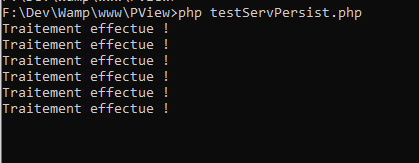
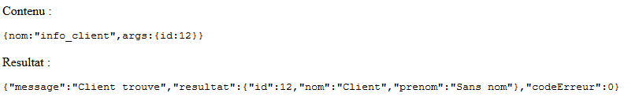

# Services Persistants PHP-PV

## Présentation

Un Service Persistant est un script PHP qui s'exécute en ligne de commande sans s'arrêter.

Il est idéal pour le traitement des queues, et les connexions persistantes.

Le service persistant est un élément d'application. Il hérite de la classe **\Pv\ServicePersist\ServicePersist**, et doit réécrire sa méthode **ExecuteSession()**.


```php
class MonServicePersistant1 extends \Pv\ServicePersist\ServicePersist
{
public $AccepterTousChemins = 1 ;
protected function ExecuteSession()
{
echo "Traitement effectue !\n" ;
}
}
```

Inscrivez le service persistant dans la méthode **ChargeServsPersists()** de l'application. Utilisez la méthode **InsereServPersist($nom, $serv)**. 

```php
class MonApplication1 extends \Pv\Application\Application
{
public function ChargeServsPersists()
{
$this->InsereServPersist("monServ1", new MonServicePersistant1()) ;
}
}
```

Chaque 5 secondes, le service persistant exécute les instructions de **ExecuteSession()**.



## Propriétés / Méthodes principales

Fonction | Description
------------ | -------------
$DelaiAttente | Délai (en sécondes) entre chaque exécution de session. Valeur par défaut : 5
$Arreter | Valeur bool, pour arrêter le script à la fin d'une session. Valeur par défaut : false.
$MaxSessions | Maximum de session à exécuter, avant d'arrêter le script. Si la valeur est 0, le script ne s'arrêtera jamais.
$TotalSessions | Total de sessions terminées. Ainsi, la valeur sera 1 pour la 2ème session.

```php
class MonServicePersistant1 extends \Pv\ServicePersist\ServicePersist
{
public $AccepterTousChemins = 1 ;
public $DelaiAttente = 2 ;
protected function ExecuteSession()
{
echo "Traitement effectue !\n" ;
// On arrete apres la 4ème session
if($this->TotalSessions == 3)
{
$this->Arreter = true ;
}
}
}
```

## Etats du service

Le service persistant capture les temps entre chaque session, pour redémarrer en cas de plantage.

Pour le configurer, commencez par déclarer le répertoire sauvegarde des états dans l'application. Renseignez la propriété **$ChemRelRegServsPersists**. Le chemin est relatif au dossier racine de PHP-PV.

```php
class MonApplication1 extends \Pv\Application\Application
{
public $ChemRelRegServsPersists = "services/data" ;
}
```

Dans ce cas, la structure des dossiers sera :

```
/php-pv-master
/services
	/data
mon_service.php
```

Exécutez votre script PHP, et vous verrez le fichier Etat généré dans votre répertoire.

## Vérification du service

Un service peut être planté dans plusieurs cas :

- il est toujours d'exécution
- il sauvegarde régulièrement son état

Pour vérifier son fonctionnement, vous pouvez réécrire sa méthode **Verifie()**.

```php
class MonServicePersistant1 extends \Pv\ServicePersist\ServicePersist
{
public $AccepterTousChemins = 1 ;
protected function ExecuteSession()
{
$bd = new MaBD() ;
// Traitement des lignes. Supprimer toutes celles
// qui ont une date_creation antérieures à 1 jour
$bd->RunSql("delete from matable where date_creation < SELECT ADDDATE(NOW(), INTERVAL -1 DAY)") ;
}
public function Verifie()
{
$bd = new MaBD() ;
$lgn = $bd->FetchSqlRow("select count(0) total from matable where date_creation < SELECT ADDDATE(NOW(), INTERVAL -2 DAY)") ;
if(! is_array($lgn) || $lgn["total"] > 0) // Connexion à la base de données échoué ou lignes non traitée
{
return false ;
}
else
{
return true ;
}
}
}
```

L'application crée une tâche programmée qui exécutera les méthodes **Verifie()** des services persistants. Pour l'activer, inscrivez la tâche avec la méthode **InscritCtrlServsPersists($nomTache)**. Personnalisez la avec la propriété **$CtrlServsPersists**.

Structure des fichiers
```
/php-pv-master
/services
	/data
	/verifie.php
mon_service.php
```

Déclaration de l'application dans **/mon_service.php**.
```php
class MonApplication1 extends \Pv\Application\Application
{
public $ChemRelRegServsPersists = "services/data" ;
public function ChargeServsPersists()
{
$this->InscritCtrlServsPersists("ctrlServs") ;
// Chemin du script rattaché à la tache programmée
$this->CtrlServsPersists->CheminFichierRelatif = "services/verifie.php" ;
// Inscrire les autres services...
$this->InsereServPersist("monServ1", new MonServicePersistant1()) ;
}
}
// Déclarez les autres classes (services persistants etc)
class MonServicePersistant1 extends \Pv\ServicePersist\ServicePersist
```

Contenu du fichier **/services/verifie.php**.

```php
<?php
include dirname(__FILE__)."/../mon_service.php" ;
?>
```

## Le processeur de queues

Ce service persistant automatise le traitement de queues. La classe est **\Pv\ProcesseurQueue\ProcesseurQueue**.

```php
class ProcesseurQueue1 extends \Pv\ProcesseurQueue\ProcesseurQueue
{
}
```

Dans la classe, réécrivez la méthode **ChargeElements()**, pour récupérer les éléments en attente.

```php
class ProcesseurQueue1 extends \Pv\ProcesseurQueue\ProcesseurQueue
{
protected function ChargeElements()
{
$bd = new MaBD() ;
$this->ElementsBruts = $bd->FetchSqlRows("select * from matable limit 0, 10") ;
}
}
```

Manipulez la propriété **$ElementActif**->**ContenuBrut** dans la méthode, dans la méthode **TraiteElementActif()**.

```php
class ProcesseurQueue1 extends \Pv\ProcesseurQueue\ProcesseurQueue
{
protected function ChargeElements()
{
$bd = new MaBD() ;
$this->ElementsBruts = $bd->FetchSqlRows("select * from matable limit 0, 10") ;
}
protected function TraiteElementActif()
{
echo "Champ 1 : ".$this->ElementActif->ContenuBrut["champ1"]."\n" ;
// Supprimer l'element en base
$bd = new MaBD() ;
$ok = $bd->RunSql("delete from matable where id=:id", array("id" => $this->ElementActif->ContenuBrut["id"])) ;
}
}
```

## Le serveur d'appels socket

### Déclaration

Le serveur d'appels socket installe un serveur socket. Sa classe est **\Pv\ServeurSocket\Appels**.

La classe est **\Pv\ServeurSocket\Appels**. Renseignez ces propriétés :

Propriété | Description
------------ | -------------
$Port | Port d'écoute du serveur socket. Par défaut, 4401
$Hote | Nom d'hote du serveur socket. Par défaut, "127.0.0.1"
$Scheme | Protocole : "tcp" (par défaut) ou "udp"

```php
class MonServeurSocket extends \Pv\ServeurSocket\Appels
{
public $Scheme = "tcp" ;
public $Hote = "127.0.0.1" ;
public $Port = 4401 ;
}
```

### Méthodes socket

Le serveur socket contient des méthodes, qui correspondent à la requête reçue.

Vous créez de nouvelles méthodes à partir de la classe **\Pv\ServeurSocket\Methode\MethodeSocket**. Réécrivez sa méthode **ExecuteInstructions()**. A l'intérieur, utilisez les méthodes suivantes pour les valeurs retours : **ConfirmeSucces($msg, $resultat=null)** pour le succès sinon **RenseigneErreur($code, $msg, $resultat=null)**.

```php
class MtdSockAPropos extends \Pv\ServeurSocket\Methode\MethodeSocket
{
protected function ExecuteInstructions()
{
$this->ConfirmeSucces("OK", 1) ;
}
}
```

Après la déclaration, inscrivez la dans la classe Serveur socket, dans **ChargeConfig()**. Utilisez **InsereMethode($nom, $mtd)**.

```php
class MonServeurSocket extends \Pv\ServeurSocket\Appels
{
public $Port = 4401 ;
public function ChargeConfig()
{
$this->InsereMethode("a_propos", new MtdSockAPropos()) ;
}
}
```

Le serveur socket contient aussi 3 méthodes spécifiques :

Propriété | Méthode d'initiation | Description
------------ | ------------- | -------------
$MethodeNonTrouve | CreeMethodeNonTrouve() | Méthode exécutée si aucune méthode spécifiée
$MethodeTest | CreeMethodeTest() | Méthode de test
$MethodeVerif | CreeMethodeVerif() | Vérifie si le serveur Socket n'est pas planté

```php
class MtdSockNonTrouve extends \Pv\ServeurSocket\Methode\MethodeSocket
{
protected function ExecuteInstructions()
{
$this->RenseigneErreur(-1, "La methode que vous avez demandee n'existe pas") ;
}
}
class MonServeurSocket extends \Pv\ServeurSocket\Appels
{
public $Port = 4401 ;
public function CreeMethodeNonTrouve()
{
return new MtdSockNonTrouve() ;
}
}
```

### Tests de requête

Le serveur socket encode les requêtes au format natif PHP. Veuillez changer au format JSON, si vous testez les requêtes. Retournez l'instance **\Pv\ServeurSocket\Format\JSON** dans sa méthode **CreeFormatPaquet()**.

```php
class MonServeurSocket extends \Pv\ServeurSocket\Appels
{
public $Port = 4422 ;
protected function CreeFormatPaquet()
{
return new \Pv\ServeurSocket\Format\JSON() ;
}
}
```
Démarrez ensuite le serveur socket. Le format des requêtes est : 
```javascript
{nom : "nom_methode", args : { "prop1" : "val1", "prop2" : "val2" }}
```

Si vous invoquez la méthode "test", vous enverrez :

```javascript
{nom:"test",args:{}}
```

Testez avec PHP à partir des fonctions socket **fsockopen()**...

```php
<?php
$hote = '127.0.0.1' ;
$port = 4422 ;
$fh = fsockopen('tcp://'.$hote, $port) ;
$contenu = '{nom:"test",args:{}}'."\r\n" ;
fputs($fh, $contenu) ;
$result = stream_get_contents($fh) ;
fclose($fh) ;
echo "<p>Contenu : </p><pre>".htmlentities($contenu).'</pre>' ;
echo "<p>Resultat : </p><pre>".htmlentities($result).'</pre>' ;
```

### Arguments de requête

La méthode filtre les arguments reçus. Donnez leurs valeurs par défaut dans la propriété **$ArgsParDefaut**.

```php
class MtdSockInfoClient extends \Pv\ServeurSocket\Methode\MethodeSocket
{
public $ArgsParDefaut = array("code_reference" => null) ;
}
```

Vous accédez aux valeurs reçues avec la propriété **$Args**, disponible dans **ExecuteInstructions()**.

```php
class MtdSockInfoClient extends \Pv\ServeurSocket\Methode\MethodeSocket
{
public $ArgsParDefaut = array("id" => 0) ;
protected function ExecuteInstructions()
{
$id = $this->Args["id"] ;
$client = new StdClass ;
$client->id = $id ;
$client->nom = "Client" ;
$client->prenom = "Sans nom" ;
$this->ConfirmeSucces("Client trouve", $client) ;
}
}
class MonServeurSocket1 extends \Pv\ServeurSocket\Appels
{
public $AccepterTousChemins = 1 ;
public $Port = 4422 ;
protected function CreeFormatPaquet()
{
return new \Pv\ServeurSocket\Format\JSON() ;
}
public function ChargeConfig()
{
$this->InsereMethode("info_client", new MtdSockInfoClient()) ;
}
}
```



### Méthodes / Propriétés principales

La méthode possède ces propriétés :

Propriété | Méthode d'initiation
------------ | -------------
PrepareExecution(& $serveur, $nom, $args=array()) | Assigne le serveur socket à la méthode lors de l'appel. Vous devez garder l'instruction **parent::PrepareExecution($serveur, $nom, $args)** à l'intérieur
TermineExecution() | Exécutée après **ExecuteInstructions()**. Gardez **parent::TermineExecution()** à l'intérieur.
$Serveur | Serveur socket qui a reçu l'appel
$NomAppel | Nom de la méthode appelée
ErreurTrouvee() | Verifie si le retour défini est une erreur
EstSucces() | Verifie si le retour défini est un succès

```php
class MtdSockInfoClient extends \Pv\ServeurSocket\Methode\MethodeSocket
{
protected $BdSupport ;
protected function PrepareExecution(& $serveur, $nom, $args=array())
{
parent::PrepareExecution($serveur, $nom, $args) ;
$this->BdSupport = new MaBD() ;
$this->BdSupport->AutoCloseConnection = false ;
if(! $this->BdSupport->InitConnection())
{
$this->RenseigneErreur(1, $this->BdSupport->ConnectionException) ;
$this->BdSupport = null ;
}
else
{
$this->ConfirmeSucces("Connexion etablie", 1) ;
}
}
protected function ExecuteInstructions()
{
if(! $this->EstSucces())
{
return ;
}
protected function TermineExecution()
{
$this->BdSupport->FinalConnection() ;
parent::TermineExecution() ;
}
}
```

## Voir aussi

- [L'Application](application.md)
- [Les tâches programmées](tachesprogs.md)
- [Index](index.md)