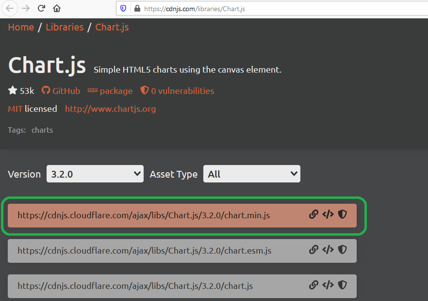
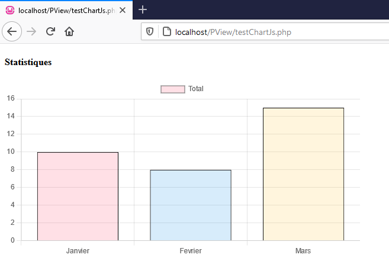
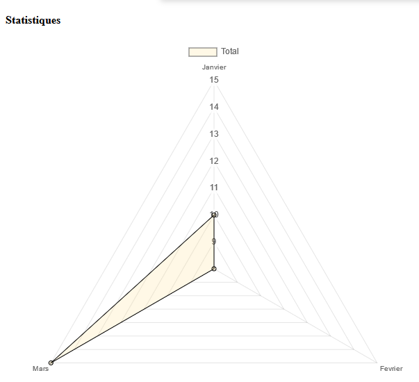

# Le composant ChartJS - PHP-PV

## Présentation

C'est un composant IU pour afficher les diagrammes de la librairie JS [ChartJS](https://www.chartjs.org/).

## Installation

Identifiez la dernière version de ChartJS sur CDN, https://cdnjs.com/libraries/Chart.js. Copiez l'URL de la version minifiée, dont le nom a ce format https://cdnjs.cloudflare.com/ajax/libs/Chart.js/x.x.x/chart.min.js.

Exemple :
```
https://cdnjs.cloudflare.com/ajax/libs/Chart.js/3.2.0/chart.min.js
```



Ouvrez le code source de votre script web, et déclarez le composant dans la méthode **DetermineEnvironnement()**.

```php
public function DetermineEnvironnement()
{
// Autres instructions avant
// ...
$this->ChartPrinc = new \Pv\ZoneWeb\ChartJs\ChartJs() ;
// Définir la source JS 
$this->ChartPrinc->CheminJsSource = "https://cdnjs.cloudflare.com/ajax/libs/Chart.js/3.2.0/chart.min.js" ;
// Désactiver la source CSS
$this->ChartPrinc->CheminCSSSource = "" ;
// 
$this->ChartPrinc->AdopteScript("chartPrinc", $this) ;
$this->ChartPrinc->ChargeConfig() ;
$this->ChartPrinc->FournisseurDonnees = new \Pv\FournisseurDonnees\Direct() ;
$this->ChartPrinc->FournisseurDonnees->Valeurs["stats"] = array(
	array("mois" => "Janvier", "total" => 10),
	array("mois" => "Fevrier", "total" => 8),
	array("mois" => "Mars", "total" => 15),
) ;
$this->ChartPrinc->DefinitColLabel("mois", "Mois") ;
$colData = $this->ChartPrinc->InsereColData("total", "Total") ;
// Fin
}
```
Déclarez la méthode **RenduSpecifique()** pour le rendu.

```php
public function RenduSpecifique()
{
$ctn = '' ;
$ctn .= '<h4>Statistiques</h4>' ;
// Rendu du Chart
$ctn .= '<div style="width:600px">'.$this->ChartPrinc->RenduDispositif().'</div>' ;
return $ctn ;
}
```

Resultat :



## Formes du graphique

Vous pouvez modifier la configuration Javascript du composant avec la propriété **$CfgInit**. Sa propriété **$type** contient la forme du diagramme.

```php
// Changer en diagramme en baton
$this->ChartPrinc->CfgInit->type = "line" ;
```

Référez vous à la documentation de [ChartJS](https://www.chartjs.org/docs/latest/charts/radar.html) pour l'initiation de chaque type de graphique.

```php
// Cas d'un diagramme radar
// URL de la documentation : https://www.chartjs.org/docs/latest/charts/radar.html
$this->ChartPrinc->CfgInit->type = "radar" ;
$this->ChartPrinc->CfgInit->options = json_decode('{
	elements: {
		line: {
			borderWidth: 6
		}
	}
}') ;
```

## Propriétés d'initiation

Propriété | Description
------------- | -------------
$CheminJsSource | Chemin du fichier **Chart.js**. Valeur par défaut : **js/Chart.bundle.min.js**.
$CheminCSSSource | Chemin du fichier **Chart.css**. Valeur par defaut : **js/Chart.min.css**. Les nouvelles versions de ChartJS n'utilisent pas de CSS. Mettez cette propriété à la valeur vide (**""**).

```php
$this->Chart1 = new \Pv\ZoneWeb\ChartJs\ChartJs() ;
// Initiation
$this->Chart1->CheminJsSource = "https://cdnjs.cloudflare.com/ajax/libs/Chart.js/3.2.0/chart.min.js" ;
$this->Chart1->CheminCSSSource = "" ;
// Chargement de la config
$this->Chart1->AdopteScript("chart1", $this) ;
```

## Filtres de sélection

Méthode | Description
------------- | -------------
InsereFltSelectHttpGet($nom, $exprDonnees='', $nomClsComp='') | Ajoute un filtre http GET
InsereFltSelectHttpPost($nom, $exprDonnees='', $nomClsComp='') | Ajoute un filtre http POST
InsereFltSelectHttpUpload($nom, $cheminDossierDest="", $exprDonnees='', $nomClsComp='') | Ajoute un filtre http UPLOAD. Tous les fichiers téléchargés seront déposés dans le dossier $cheminDossierDest.
InsereFltSelectSession($nom, $exprDonnees='', $nomClsComp='') | Ajoute un filtre contenant la valeur d'une session
InsereFltSelectFixe($nom, $valeur, $exprDonnees='', $nomClsComp='') | Ajoute un filtre basé sur une valeur fixe
InsereFltSelectCookie($nom, $exprDonnees='', $nomClsComp='') | Ajoute un filtre contenant la valeur d'un cookie

```php
// ...
// Chargement de la config
$this->Chart1->ChargeConfig() ;
// Insertion d'un filtre Fixe
$this->Chart1->InsereFltSelectFixe("idMembre", $this->ZoneParent->IdMembreConnecte(), "id_membre = <self>") ;
// Insertion d'un filtre Http Get
$this->Chart1->InsereFltSelectHttpGet("idCateg", "id_categorie = <self>") ;
```

## Propriétés / méthodes spécifiques

Propriété/Méthode | Description
------------- | -------------
InsereColData($nom, $libelle='', $alias='') | Insere une colonne dataset, pour l'ordonnée.
InsereColonne($nom, $libelle='', $alias='') | Insere une colonne dataset, pour l'ordonnée.
DefinitColLabel($nom, $libelle='', $alias='') | Définit la colonne libellé. (en abcisse)
IndexColonneTri | Index de la colonne pour le tri. 0 par défaut (colonne libellé)
SensColonneTri | Sens de tri des valeurs.
Largeur | Largeur du graphique
Hauteur | Hauteur du graphique

```php
// Chargement de la config
$this->Chart1->ChargeConfig() ;
// ...
$this->Chart1->InsereColonne("total_abonnes", "Abonnés") ;
$this->Chart1->InsereColonne("montant_transactions", "Transactions") ;
$this->Chart1->DefinitColLabel("date_souscription", "Jour") ;
// Fournisseur de données
$this->Chart1->FournisseurDonnees = new \Pv\FournisseurDonnees\Sql() ;
$this->Chart1->FournisseurDonnees->BaseDonnees = new MaBD1() ;
$this->Chart1->FournisseurDonnees->RequeteSelection = "(
select
	date(date_souscription) date_souscription,
	count(id_abonne) total_abonnes,
	sum(montant) montant_transactions
from souscription
)" ;
```

## Couleurs du graphique

Chaque colonne dataset possède deux propriétés pour les couleurs :
- **$CouleursBackground** : arrière plan
- **$CouleursBordure** : arrière plan

Ce sont des tableaux avec des valeurs du format **rgb(R, V, B, O)**.

```php
$colData = $this->ChartPrinc->InsereColData("total", "Total") ;
$colData->CouleursBackground = array(
	'rgba(255, 220, 132, 0.2)'
) ;
```



## Propriétés après rendu

Après avoir utilisé la méthode **RenduDispositif()**, ce composant renseigne la propriété **$Elements**.

```php
public function RenduSpecifique()
{
$ctn = $this->ChartPrinc->RenduDispositif() ;
$ctn .= count($this->ChartPrinc->Elements).' valeurs trouv&eacute;es' ;
return $ctn ;
}
```

Vous pouvez ainsi faire le tableau récapitulatif :

```php
$ctn = '' ;
$ctn .= '<table>' ;
$ctn .= '<thead>' ;
$ctn .= '<tr>' ;
$ctn .= '<th>'.$chart->ColonneLabel->Libelle.'</th>' ;
foreach($chart->ColonnesDataset as $i => $col)
{
$ctn .= '<th>'.$col->Libelle.'</th>' ;
}
$ctn .= '</tr>' ;
$ctn .= '</thead>' ;
$ctn .= '<tbody>' ;
foreach($chart->Elements as $i => $lgn)
{
$ctn .= '<tr>' ;
foreach($lgn as $n => $v)
{
	$ctn .= '<td>'.htmlentities($v).'</td>' ;
}
$ctn .= '</tr>' ;
}
$ctn .= '</tbody>' ;
$ctn .= '</table>' ;
$ctn .= '</table>' ;
```

## Voir aussi

- [Zone web](zoneweb.md)
- [Entêtes de document](entetedoc.md)
- [Scripts web](scripts.md)
- [Documents web](documents.md)
- [Composants de rendu](composants_rendu.md)
