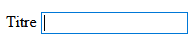

# Les composants de liste pour formulaire

## \Pv\ZoneWeb\FiltreDonnees\Composant\ZoneSelect

### Présentation

Affiche une liste déroulante pour sélectionner une valeur. Correspond au tag HTML \<select\>.

```php
$comp = $filtre->DeclareComposant("\Pv\ZoneWeb\FiltreDonnees\Composant\ZoneSelect") ;
$comp->FournisseurDonnees = new \Pv\FournisseurDonnees\Direct() ;
$comp->FournisseurDonnees->Valeurs["categories"] = array(
	array("id" => 1, "titre" => "Defaut"),
	array("id" => 2, "titre" => "Livre"),
	array("id" => 3, "titre" => "Tableau"),
	array("id" => 4, "titre" => "Calendrier"),
) ;
$comp->NomColonneValeur = "id" ;
$comp->NomColonneLibelle = "titre" ;
```



### Propriétés/Méthodes spécifiques


