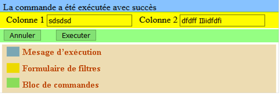

# Le Formulaire de Données

## Présentation

Le formulaire de données est un composant IU.
Il affiche :
- Un message d'exécution : 
- Un formulaire de filtres : Il contiendra des champs qui seront soumis par la méthode « POST ».
- Un bloc de commandes : Il contiendra des boutons, qui recevront les valeurs du formulaire



La classe du formulaire de données est **\Pv\ZoneWeb\FormulaireDonnees\FormulaireDonnees**.

## Utilisation

Voici un exemple d'utilisation.

```php
class MonScript2 extends \Pv\ZoneWeb\Script\Script
{
public $Form1 ;
public $Flt1 ;
public $Flt2 ;
public function DetermineEnvironnement()
{
// Initiation
$this->Form1 = $this->InsereComposant("form1", new \Pv\ZoneWeb\FormulaireDonnees\FormulaireDonnees()) ;
// Toujours afficher le formulaire
$this->Form1->InclureElementEnCours = 0 ;
$this->Form1->InclureTotalElements = 0 ;
// Définir la classe commande "Executer"
$this->Form1->NomClasseCommandeExecuter = "MaCmdExecScript2" ;
// Chargement de la config
$this->Form1->ChargeConfig() ;
// Définition des autres propriétés
$this->Flt1 = $this->Form1->InsereFltEditHttpPost("champ1") ;
$this->Flt1->Libelle = "Champ 1" ;
$this->Flt2 = $this->Form1->InsereFltEditHttpPost("champ2") ;
$this->Flt2->Libelle = "Champ 2" ;
}
public function RenduSpecifique()
{
$ctn = '' ;
// Rendu du formulaire de donnees
$ctn .= $this->Form1->RenduDispositif() ;
return $ctn ;
}
}
class MaCmdExecScript2 extends \Pv\ZoneWeb\Commande\Executer
{
protected function ExecuteInstructions()
{
$this->ConfirmeSucces("Commande exécutée avec succès") ;
}
}
```

## Interaction avec base de données

Vous pouvez manipuler les bases de données avec son fournisseur de données.

### Ajout d'enregistrement

```php
class MonScript2 extends \Pv\ZoneWeb\Script\Script
{
public function DetermineEnvironnement()
{
// Initiation
$this->Form1 = $this->InsereComposant("form1", new \Pv\ZoneWeb\FormulaireDonnees\FormulaireDonnees()) ;
// Toujours afficher le formulaire
$this->Form1->InclureElementEnCours = 0 ;
$this->Form1->InclureTotalElements = 0 ;
// Définir la classe commande "Executer"
$this->Form1->NomClasseCommandeExecuter = "\Pv\ZoneWeb\Commande\AjoutElement" ;
// Chargement de la config
$this->Form1->ChargeConfig() ;
// Définition des autres propriétés
$this->Flt1 = $this->Form1->InsereFltEditHttpPost("colonne1", "colonne1") ;
$this->Flt1->Libelle = "Colonne 1" ;
$this->Flt2 = $this->Form1->InsereFltEditHttpPost("colonne2", "colonne2") ;
$this->Flt2->Libelle = "Colonne 2" ;
// Définition du fournisseur de données
$this->FournisseurDonnees = new \Pv\FournisseurDonnees\Sql() ;
$this->FournisseurDonnees->BaseDonnees = new MaBD() ;
$this->FournisseurDonnees->RequeteSelection = "matable1" ;
$this->FournisseurDonnees->TableEdition = "matable1" ;
}
```

### Modification d'enregistrement

```php
class MonScript2 extends \Pv\ZoneWeb\Script\Script
{
public function DetermineEnvironnement()
{
// Initiation
$this->Form1 = $this->InsereComposant("form1", new \Pv\ZoneWeb\FormulaireDonnees\FormulaireDonnees()) ;
// Afficher le formulaire s'il y a un enregistrement
$this->Form1->InclureElementEnCours = 1 ;
$this->Form1->InclureTotalElements = 1 ;
// Définir la classe commande "Executer"
$this->Form1->NomClasseCommandeExecuter = "\Pv\ZoneWeb\Commande\ModifElement" ;
// Chargement de la config
$this->Form1->ChargeConfig() ;
// Définition des filtres de sélection
$this->Cle1 = $this->Form1->InsereFltSelectHttpGet("macle1", "cle1 = <self>") ;
// Définition des autres propriétés
$this->Flt1 = $this->Form1->InsereFltEditHttpPost("colonne1", "colonne1") ;
$this->Flt1->Libelle = "Colonne 1" ;
$this->Flt2 = $this->Form1->InsereFltEditHttpPost("colonne2", "colonne2") ;
$this->Flt2->Libelle = "Colonne 2" ;
// Définition du fournisseur de données
$this->FournisseurDonnees = new \Pv\FournisseurDonnees\Sql() ;
$this->FournisseurDonnees->BaseDonnees = new MaBD() ;
$this->FournisseurDonnees->RequeteSelection = "matable1" ;
$this->FournisseurDonnees->TableEdition = "matable1" ;
}
```

### Suppression d'enregistrement

```php
class MonScript2 extends \Pv\ZoneWeb\Script\Script
{
public function DetermineEnvironnement()
{
// Initiation
$this->Form1 = $this->InsereComposant("form1", new \Pv\ZoneWeb\FormulaireDonnees\FormulaireDonnees()) ; ;
// Afficher le formulaire s'il y a un enregistrement
$this->Form1->InclureElementEnCours = 1 ;
$this->Form1->InclureTotalElements = 1 ;
// Empêcher l'édition des filtres
$this->Form1->Editable = 0 ;
// Définir la classe commande "Executer"
$this->Form1->NomClasseCommandeExecuter = "\Pv\ZoneWeb\Commande\SupprElement" ;
// Chargement de la config
$this->Form1->ChargeConfig() ;
// Définition des filtres de sélection
$this->Cle1 = $this->Form1->InsereFltSelectHttpGet("macle1", "cle1 = <self>") ;
// Définition des autres propriétés
$this->Flt1 = $this->Form1->InsereFltEditHttpPost("colonne1", "colonne1") ;
$this->Flt1->Libelle = "Colonne 1" ;
$this->Flt2 = $this->Form1->InsereFltEditHttpPost("colonne2", "colonne2") ;
$this->Flt2->Libelle = "Colonne 2" ;
// Définition du fournisseur de données
$this->FournisseurDonnees = new \Pv\FournisseurDonnees\Sql() ;
$this->FournisseurDonnees->BaseDonnees = new MaBD() ;
$this->FournisseurDonnees->RequeteSelection = "matable1" ;
$this->FournisseurDonnees->TableEdition = "matable1" ;
}
```

## Propriétés d'initiation

Propriété | Description
------------- | -------------
$InclureElementEnCours | Le formulaire sera disponible si le fournisseur de données contient au moins un enregistrement
$InclureTotalElement | Comptera le nombre d'enregistrement du fournisseur de données.
$InscrireCommandeExecuter | Crée une commande « Exécuter » au chargement de  config du composant
$LibelleCommandeExecuter | Libellé de la commande « Exécuter »
$NomClasseCommandeExecuter | Nom de la classe commande « Exécuter »
$InscrireCommandeAnnuler | Crée une commande « Annuler » au chargement de  config du composant
$LibelleCommandeAnnuler | Libellé de la commande « Annuler »
$NomClasseCommandeAnnuler | Nom de la classe commande « Annuler »

```php
// Initiation
$this->Form1 = $this->InsereComposant("form1", new \Pv\ZoneWeb\FormulaireDonnees\FormulaireDonnees()) ;
$this->Form1->LibelleCommandeExecuter = "Valider" ;
$this->Form1->InscrireCommandeAnnuler = false ;
// Après initiation, charger le formulaire
$this->Form1->ChargeConfig() ;
```

## Filtres de sélection

Méthode | Description
------------- | -------------
InsereFltLgSelectHttpGet($nom, $exprDonnees='', $nomClsComp='') | Ajoute un filtre http GET
InsereFltLgSelectHttpPost($nom, $exprDonnees='', $nomClsComp='') | Ajoute un filtre http POST
InsereFltLgSelectHttpUpload($nom, $cheminDossierDest="", $exprDonnees='', $nomClsComp='') | Ajoute un filtre http UPLOAD. Tous les fichiers téléchargés seront déposés dans le dossier $cheminDossierDest.
InsereFltLgSelectSession($nom, $exprDonnees='', $nomClsComp='') | Ajoute un filtre contenant la valeur d'une session
InsereFltLgSelectFixe($nom, $valeur, $exprDonnees='', $nomClsComp='') | Ajoute un filtre basé sur une valeur fixe
InsereFltLgSelectCookie($nom, $exprDonnees='', $nomClsComp='') | Ajoute un filtre contenant la valeur d'un cookie
InsereFltSelectHttpGet($nom, $exprDonnees='', $nomClsComp='') | Ajoute un filtre http GET
InsereFltSelectHttpPost($nom, $exprDonnees='', $nomClsComp='') | Ajoute un filtre http POST
InsereFltSelectHttpUpload($nom, $cheminDossierDest="", $exprDonnees='', $nomClsComp='') | Ajoute un filtre http UPLOAD. Tous les fichiers téléchargés seront déposés dans le dossier $cheminDossierDest.
InsereFltSelectSession($nom, $exprDonnees='', $nomClsComp='') | Ajoute un filtre contenant la valeur d'une session
InsereFltSelectFixe($nom, $valeur, $exprDonnees='', $nomClsComp='') | Ajoute un filtre basé sur une valeur fixe
InsereFltSelectCookie($nom, $exprDonnees='', $nomClsComp='') | Ajoute un filtre contenant la valeur d'un cookie

```php
// Utilisation d'un filtre HTTP GET
$flt = $form->InsereFltSelectHttpGet("id", "id=<self>") ;
// Utilisation d'un filtre fixe
$flt = $form->InsereFltSelectFixe("id_membre", $this->IdMembreConnecte(), "id_membre_creation=<self>") ;
```

## Filtres d'édition

Méthode | Description
------------- | -------------
InsereFltEditHttpGet($nom, $colLiee='', $nomClsComp='') | Ajoute un filtre http GET
InsereFltEditHttpPost($nom, $colLiee='', $nomClsComp='') | Ajoute un filtre http POST
InsereFltEditHttpUpload($nom, $cheminDossierDest="", $colLiee='', $nomClsComp='') | Ajoute un filtre http UPLOAD. Tous les fichiers téléchargés seront déposés dans le dossier $cheminDossierDest
InsereFltEditSession($nom, $colLiee='', $nomClsComp='') | Ajoute un filtre contenant la valeur d'une session
InsereFltEditFixe($nom, $valeur, $colLiee='', $nomClsComp='') | Ajoute un filtre basé sur une valeur fixe
InsereFltEditCookie($nom, $colLiee='', $nomClsComp='') | Ajoute un filtre contenant la valeur d'un cookie

```php
// Filtre Http POST
$flt1 = $form->InsereFltEditHttpPost("param_titre", "titre") ;
// Filtre HTTP Upload. Les fichiers seront déposés dans le dossier "upload"
$flt2 = $form->InsereFltEditHttpUpload("fichier1", "upload", "chem_fichier1") ;
// Filtre Fixe
$flt3 = $form->InsereFltEditFixe("date_action", date("Y-m-d H:i:s", "date_modif") ;
```

## Autres propriétés

Propriété / Méthode | Description
------------- | -------------
$CacherBlocCommandes | N'affiche pas le bloc de commandes
$CacherFormulaireFiltres | N'affiche pas le formulaire des filtres
$MessageAucunElement | Message à afficher si le formulaire ne trouve pas d'élément
$CacherFormulaireFiltresApresCmd | Cache le formulaire de filtres si une commande est exécutée
$Largeur | Largeur du formulaire
$ElementsEnCours | Lignes retournées après le rendu
$ElementEnCours | 1ère Ligne retournée après le rendu
RedirigeCmdAnnulerVersUrl($url) | Redirige la page vers l'URL lorsque vous cliquez sur le bouton « Annuler » du formulaire
RedirigeCmdExecuterVersUrl($url) | Redirige la page vers l'URL lorsque vous cliquez sur le bouton « Executer » du formulaire
FigeFiltresEdition() | Fixe tous les filtres édition en lecture seule
CacheFiltresEdition() | Cache tous les filtres édition
DoitInclureElement() | Confirme si les propriétés $InclureElementEnCours & $InclureTotalElements sont vraies.
AnnuleLiaisonParametres() | Interdit les filtres d'édition de récupérer les valeurs de leurs paramètres.

```php
$form->CacherBlocCommandes = true ;
$form->FigeFiltresEdition() ;
```

## Commandes

Vous pouvez ajouter des commandes au formulaire de données, par la méthode **InsereCommande(\$nomCmd, \$commande)**.

```php
$cmdModif = $form1->InsereCommande("cmdModif", new \Pv\ZoneWeb\Commande\Executer()) ;
```

Vous avez plusieurs classes prédéfinies.

Classe | Prérequis | Description
------------- | ------------- | -------------
\Pv\ZoneWeb\Commande\Annuler | Aucun | Commande pour annuler l'édition du formulaire de données
\Pv\ZoneWeb\Commande\Executer | Aucun | Commande pour exécuter le formulaire de données. Veuillez étendre cette classe.
\Pv\ZoneWeb\Commande\AjoutElement | Les propriétés InclureElementEnCours & InclureTotalElements doivent avoir la valeur 0 | Commande pour insérer un enregistrement dans le fournisseur de données du formulaire
\Pv\ZoneWeb\Commande\ModifElement | Les propriétés InclureElementEnCours & InclureTotalElements doivent avoir la valeur 1 | Commande pour modifier un enregistrement dans le fournisseur de données du formulaire
\Pv\ZoneWeb\Commande\SupprElement | Les propriétés InclureElementEnCours & InclureTotalElements doivent avoir la valeur 1 | Commande pour supprimer un enregistrement dans le fournisseur de données du formulaire

```php
$form->NomClasseCommandeAnnuler = '\Pv\ZoneWeb\Commande\Executer' ;
$cmd1 = $form->InsereCommande("commande3", new \Pv\ZoneWeb\Commande\SupprElement()) ;
```

Vous pouvez référencer la fonction **AppliqueCommande(\$cmd)** du script parent ou de la zone, sur les commandes :

Méthode | Description
------------- | -------------
AppliqueScriptParentCmdExec() | Exécutera la fonction du script parent sur click de la commande Exécuter
AppliqueScriptParentCmdAnnul() | Exécutera la fonction du script parent sur click de la commande Exécuter
AppliqueZoneParentCmdExec() | Exécutera la fonction de la zone sur click de la commande Exécuter
AppliqueZoneParentCmdAnnul() | Exécutera la fonction de la zone sur click de la commande Exécuter

```php
class MonScript1 extends \Pv\ZoneWeb\Script\Script
{
	public function DetermineEnvironnement()
	{
		$this->Form1 = $this->InsereComposant("form1", new \Pv\ZoneWeb\FormulaireDonnees\FormulaireDonnees()) ;
		$this->Form1->ChargeConfig() ;
		$flt = $this->Form1->InsereFltEditHttpPost("nom") ;
		$this->Form1->AppliqueScriptParentCmdExec() ;
	}
	public function AppliqueCommande(& $cmd)
	{
		if($cmd->IDInstanceCalc == $this->Form1->CommandeExecuter->IDInstanceCalc)
		{
			$cmd->ConfirmeSucces() ;
		}
		else
		{
			parent::AppliqueCommande() ;
		}
	}
	public function RenduSpecifique()
	{
		$ctn = '' ;
		$ctn .= $this->Form1->RenduDispositif() ;
		return $ctn ;
	}
}
```

Insérez la classe **\Pv\ZoneWeb\Commande\AppliqueScriptParent** pour une nouvelle commande.

```php
$cmd3 = $form->InsereCommande("cmd3", new \Pv\ZoneWeb\Commande\AppliqueScriptParent()) ;
```

Insérez la classe **\Pv\ZoneWeb\Commande\AppliqueZoneParent** pour une nouvelle commande sur la zone.

```php
$cmd4 = $form->InsereCommande("cmd4", new \Pv\ZoneWeb\Commande\AppliqueZoneParent()) ;
```

## Rendu du formulaire de filtres

Vous pouvez personnaliser le rendu du formulaire de filtres avec sa propriété **$DessinateurFiltresEdition**.
Veuillez créer une classe héritant de **\Pv\ZoneWeb\DessinFiltres\Html** et réécrire sa méthode publique **Execute(& $script, & $composant, $parametres)**.
Vous avez 2 méthodes dans la nouvelle classe, pour chaque filtre de données :
- **RenduLibelleFiltre(& $filtre)** pour le libellé du filtre de données
- **RenduFiltre(& $filtre, & $composant)** pour le composant du filtre de données

```php
class MonScript1 extends \Pv\ZoneWeb\Script\Script
{
public $Form1 ;
public $Flt1 ;
public $Flt2 ;
public function DetermineEnvironnement()
{
// Initiation
$this->Form1 = new \Pv\ZoneWeb\FormulaireDonnees\FormulaireDonnees() ;
// Toujours afficher le formulaire
$this->Form1->InclureElementEnCours = 0 ;
$this->Form1->InclureTotalElements = 0 ;
// Definir le dessinateur de filtres edition
$this->Form1->DessinateurFiltresEdition = new MonDessinFiltresDonnees() ;
// Liaison avec le script en cours
$this->Form1->AdopteScript("form1", $this) ;
// Chargement de la config
$this->Form1->ChargeConfig() ;
// Définition des autres propriétés
$this->Flt1 = $this->Form1->InsereFltEditHttpPost("champ1") ;
$this->Flt1->Libelle = "Champ 1" ;
$this->Flt2 = $this->Form1->InsereFltEditHttpPost("champ2") ;
$this->Flt2->Libelle = "Champ 2" ;
}
public function RenduSpecifique()
{
$ctn = '' ;
// Rendu du formulaire de donnees
$ctn .= $this->Form1->RenduDispositif() ;
return $ctn ;
}
}
class MonDessinFiltresDonnees extends \Pv\ZoneWeb\DessinFiltres\Html
{
public function Execute(& $script, & $composant, $parametres)
{
$ctn = '' ;
$ctn .= '<p><b>'.$this->RenduLibelleFiltre($script->Flt1).'<b><br>' ;
$ctn .= $this->RenduFiltre($script->Flt1, $composant).'</p>' ;
$ctn .= '<hr>' ;
$ctn .= '<p><b>'.$this->RenduLibelleFiltre($script->Flt2).'<b><br>' ;
$ctn .= $this->RenduFiltre($script->Flt2, $composant).'</p>' ;
return $ctn ;
}
}
```

Le rendu peut se faire via la méthode **DessineFiltres(& $dessin, & $composant, $parametres)** du script parent. Invoquez **DessineFiltresScriptParent()** du formulaire.


```php
class MonScript1 extends \Pv\ZoneWeb\Script\Script
{
	public function DetermineEnvironnement()
	{
		$this->Form1 = $this->InsereComposant("form1", new \Pv\ZoneWeb\FormulaireDonnees\FormulaireDonnees()) ;
		$this->Form1->InclureElementEnCours = false ;
		$this->Form1->ChargeConfig() ;
		$this->Flt1 = $this->Form1->InsereFltEditHttpPost("nom") ;
		$this->Form1->DessineFiltresScriptParent() ;
	}
	public function DessineFiltres(& $dessin, & $composant, $parametres)
	{
		return '<p>Votre nom :<br>'.$dessin->RenduFiltre($this->Flt1, $composant).'</p>' ;
	}
	public function RenduSpecifique()
	{
		$ctn = '' ;
		$ctn .= $this->Form1->RenduDispositif() ;
		return $ctn ;
	}
}
```

## Rendu du bloc de commandes

Pour personnaliser le rendu du bloc des commandes, utilisez la propriété **$DessinateurBlocCommandes**.
Veuillez créer une classe héritant de \Pv\ZoneWeb\DessinCommandes\DessinCommandes et réécrire sa méthode publique **Execute(& $script, & $composant, $parametres)**.
Cette nouvelle classe donne le rendu d'une commande avec la méthode **RenduCommande(& $commande)**.

```php
class MonScript1 extends \Pv\ZoneWeb\Script\Script
{
public $Form1 ;
public $Flt1 ;
public $Flt2 ;
public function DetermineEnvironnement()
{
// Initiation
$this->Form1 = new \Pv\ZoneWeb\FormulaireDonnees\FormulaireDonnees() ;
// Toujours afficher le formulaire
$this->Form1->InclureElementEnCours = 0 ;
$this->Form1->InclureTotalElements = 0 ;
// Definir le dessinateur de commandes
$this->Form1->DessinateurBlocCommandes = new MonDessinCommandes() ;
// Liaison avec le script en cours
$this->Form1->AdopteScript("form1", $this) ;
// Chargement de la config
$this->Form1->ChargeConfig() ;
// Définition des autres propriétés
$this->Flt1 = $this->Form1->InsereFltEditHttpPost("champ1") ;
$this->Flt1->Libelle = "Champ 1" ;
$this->Flt2 = $this->Form1->InsereFltEditHttpPost("champ2") ;
$this->Flt2->Libelle = "Champ 2" ;
// Commandes
// …
}
public function RenduSpecifique()
{
$ctn = '' ;
// Rendu du formulaire de donnees
$ctn .= $this->Form1->RenduDispositif() ;
return $ctn ;
}
}
class MonDessinCommandes extends \Pv\ZoneWeb\DessinCommandes\DessinCommandes
{
public function Execute(& $script, & $composant, $parametres)
{
$ctn = '' ;
$ctn .= '<p>' ;
// Le formulaire est dans la variable $composant
$ctn .= $this->RenduCommande($composant->CommandeAnnuler) ;
$ctn .= '<hr />' ;
$ctn .= $this->RenduCommande($composant->CommandeExecuter) ;
$ctn .= '</p>' ;
return $ctn ;
}
}
```

Le rendu peut se faire via la méthode **DessineCommandes(& $dessin, & $composant, $parametres)** du script parent. Invoquez **DessineFiltresScriptParent()** du formulaire.

```php
class MonScript1 extends \Pv\ZoneWeb\Script\Script
{
	public function DetermineEnvironnement()
	{
		$this->Form1 = $this->InsereComposant("form1", new \Pv\ZoneWeb\FormulaireDonnees\FormulaireDonnees()) ;
		$this->Form1->InclureElementEnCours = false ;
		$this->Form1->ChargeConfig() ;
		$this->Flt1 = $this->Form1->InsereFltEditHttpPost("nom") ;
		$this->Form1->DessineCommandesScriptParent() ;
	}
	public function DessineCommandes(& $dessin, & $composant, $parametres)
	{
		return '<p>'.$dessin->RenduCommande($this->Form1->CommandeExecuter, $composant).'</p>' ;
	}
	public function RenduSpecifique()
	{
		$ctn = '' ;
		$ctn .= $this->Form1->RenduDispositif() ;
		return $ctn ;
	}
}
```

## Voir aussi

- [Zone web](zoneweb.md)
- [Scripts web](scripts.md)
- [Filtres de données](filtresdonnees.md)
- [Composants de rendu](composants_rendu.md)
- [Tableaux de données](tableauxdonnees.md)
