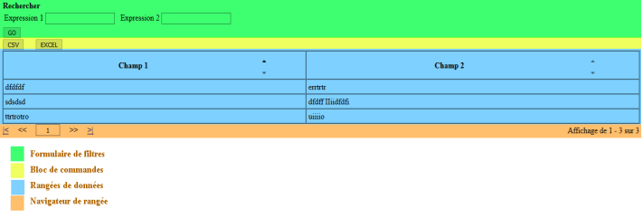

# Le Tableau de Données

## Présentation

Le tableau de données est un composant IU. Il affiche :
- Un formulaire de champs pour filtrer les résultats
- Un bloc de commandes, pour l'exportation des résultats à un format précis…
- Un tableau des résultats de la recherche
 


La classe de ce composant est **\Pv\ZoneWeb\TableauDonnees\TableauDonnes**.
 
## Utilisation

Il utilise toujours un fournisseur de données pour le rendu.

```php
class MonScript1 extends \Pv\ZoneWeb\Script\Script
{
public function DetermineEnvironnement()
{
// Déclaration
$this->Tabl1 = new \Pv\ZoneWeb\TableauDonnees\TableauDonnees() ;
// Chargement de la config
$this->Tabl1->AdopteScript("tabl1", $this) ;
$this->Tabl1->ChargeConfig() ;
// Définition des filtres de sélection
$this->Flt1 = $this->Tabl1->InsereFltSelectHttpGet("expression", "champ1 like concat(<self>, '%')") ;
$this->Flt1->Libelle = "Expression" ;
// Définition des colonnes
$this->Tabl1->InsereDefColCachee("id") ;
$this->Tabl1->InsereDefCol("champ1", "Champ 1") ;
$this->Tabl1->InsereDefCol("champ2", "Champ 2") ;
// Définition du fournisseur de données
$this->Tabl1->FournisseurDonnees = new \Pv\FournisseurDonnees\Sql() ;
$this->Tabl1->FournisseurDonnees->BaseDonnees = new MaBD1() ;
$this->Tabl1->FournisseurDonnees->RequeteSelection = "matable1" ;
}
public function RenduSpecifique()
{
$ctn = '' ;
$ctn .= $this->Tabl1->RenduDispositif() ;
return $ctn ;
}
}
```

### Filtres de sélection

Méthode | Description
------------- | -------------
InsereFltSelectHttpGet($nom, $exprDonnees='', $nomClsComp='') | Ajoute un filtre http GET
InsereFltSelectHttpPost($nom, $exprDonnees='', $nomClsComp='') | Ajoute un filtre http POST
InsereFltSelectHttpUpload($nom, $cheminDossierDest="", $exprDonnees='', $nomClsComp='') | Ajoute un filtre http UPLOAD. Tous les fichiers téléchargés seront déposés dans le répertoire $cheminDossierDest
InsereFltSelectSession($nom, $exprDonnees='', $nomClsComp='') | Ajoute un filtre contenant la valeur d'une session
InsereFltSelectFixe($nom, $valeur, $exprDonnees='', $nomClsComp='') | Ajoute un filtre basé sur une valeur fixe
InsereFltSelectCookie($nom, $exprDonnees='', $nomClsComp='') | Ajoute un filtre contenant la valeur d'un cookie

```php
// Déclaration
$this->Tabl1 = new \Pv\ZoneWeb\TableauDonnees\TableauDonnees() ;
// Chargement de la config
$this->Tabl1->AdopteScript("tabl1", $this) ;
$this->Tabl1->ChargeConfig() ;
// Définition des filtres de sélection
$this->Flt1 = $this->Tabl1->InsereFltSelectHttpGet("expression", "champ1 like concat(<self>, '%')") ;
$this->Flt1->Libelle = "Expression" ;
// Filtre fixe
$this->Flt2 = $this->Tabl1->InsereFltSelectFixe("est_actif", 1, "active = <self>") ;
// ...
```

## Définitions de colonne

Propriété / Méthode | Description
------------- | -------------
$DefinitionColonnes | Tableau des définitions de colonne
InsereDefColCachee($nomDonnees, $aliasDonnees="") | Inscrit une définition de colonne cachée. 
InsereDefColInvisible($nomDonnees, $aliasDonnees="") | 
InsereDefCol($nomDonnees, $libelle="", $aliasDonnees="") | Inscrit une définition de colonne, avec un libellé.
InsereDefColBool($nomDonnees, $libelle="", $aliasDonnees="", $valPositive="", $valNegative="") | Inscrit une définition de colonne qui affiche un libellé en fonction d'une valeur booléenne.
InsereDefColChoix($nomDonnees, $libelle="", $aliasDonnees="", $valsChoix=array()) | Inscrit une définition de colonne qui affiche un libellé en fonction d'une valeur.
InsereDefColMonnaie($nomDonnees, $libelle="", $aliasDonnees="") | Inscrit une définition de colonne au format monétaire
InsereDefColMoney($nomDonnees, $libelle="", $aliasDonnees="") | 
InsereDefColDateFr($nomDonnees, $libelle="", $inclureHeure=0) | Inscrit une définition de colonne au format Français (dd/mm/yyyy). Si $inclureHeure est égal à 1, l'heure sera affichée également.
InsereDefColDateTimeFr($nomDonnees, $libelle="", $aliasDonnees="") | Inscrit une définition de colonne au format Français (dd/mm/yyyy hh:mi:ss)
InsereDefColDetail($nomDonnees, $libelle="", $aliasDonnees="") | Inscrit une définition de colonne, qui affiche les 1ers caractères de la ligne. Si vous posez le curseur sur cette cellule, un bloc contenant le texte intégral apparaîtra.
InsereDefColHtml($modeleHtml="", $libelle="") | Inscrit une définition de colonne qui affichera un contenu HTML.
InsereDefColTimestamp($nomDonnees, $libelle="", $formatDate="d/m/Y H:i:s") | Inscrit une définition de colonne qui affichera une date à partir d'un timestamp
InsereDefColActions($libelle, $actions=array()) | Inscrit une définition de colonne affichera des liens.

```php
// Déclaration
$this->Tabl1 = new \Pv\ZoneWeb\TableauDonnees\TableauDonnees() ;
// Chargement de la config
$this->Tabl1->AdopteScript("tabl1", $this) ;
$this->Tabl1->ChargeConfig() ;
// ...
// Définition des colonnes
$this->Tabl1->InsereDefColCachee("id") ;
$this->Tabl1->InsereDefCol("champ1", "Champ 1") ;
$this->Tabl1->InsereDefColMoney("total", "Total TTC") ;
$this->Tabl1->InsereDefColHtml('<p><b>#${id}. ${champ1}</b></p>') ;
// ...
```

## Source de valeurs supplémentaires

Vous pouvez étendre les lignes calculées dans le tableau de données. Utilisez la propriété **$SourceValeursSuppl**. Etendez la classe **\Pv\ZoneWeb\Donnees\SrcValsSuppl** pour réécrire sa méthode **Applique(& $composant, $ligneDonnees)**.
Vous utiliserez ces nouvelles valeurs uniquement dans une définition de colonne HTML.

```php
class SrcValsSuppl1 extends \Pv\ZoneWeb\Donnees\SrcValsSuppl
{
public function Applique(& $composant, $ligneDonnees)
{
$results = array('menu' => '<a href="?appelleScript=developper&id='.urlencode($ligneDonnees ["id"]).'">+</a>') ;
return array_merge($ligneDonnees, $results) ;
}
}
class MonScript1 extends \Pv\ZoneWeb\Script\Script
{
public function DetermineEnvironnement()
{
$this->Tabl1 = new \Pv\ZoneWeb\TableauDonnees\TableauDonnees() ;
$this->Tabl1->AdopteScript("tabl1", $this) ;
$this->Tabl1->ChargeConfig() ;
// ...
$this->Tabl1->SourceValeursSuppl = new SrcValsSuppl1() ;
// ...
$this->Tabl1->InsereDefColCachee("id") ;
$this->Tabl1->InsereDefColHtml('${menu} ${id}', 'Actions') ;
}
}
```


Vous pouvez renseigner les valeurs supplémentaires via la méthode **ExtraitSrcValsSuppl(& $dessin, & $composant, $parametres)** du script parent. Invoquez **AppliqueScriptParentValsSuppl()** du tableau.


```php
class MonScript1 extends \Pv\ZoneWeb\Script\Script
{
	public function DetermineEnvironnement()
	{
		$this->Tabl1 = $this->InsereComposant("tabl1", new \Pv\ZoneWeb\TableauDonnees\TableauDonnees()) ;
		$this->Tabl1->InclureElementEnCours = false ;
		$this->Tabl1->ChargeConfig() ;
		// Definir vos colonnes et filtres...
		$this->Flt1 = $this->Tabl1->InsereDefCol("nom") ;
		// Fixer la source des valeurs supplémentaires au script
		$this->Tabl1->AppliqueScriptParentValsSuppl() ;
	}
	public function ExtraitSrcValsSuppl($ligneDonnees, & $composant, & $srcValsSuppl)
	{
		$ligneDonnees["lien"] = 'mapage.php?no='.urlencode($ligneDonnees["reference"]) ;
		return $ligneDonnees ;
	}
	public function RenduSpecifique()
	{
		$ctn = '' ;
		$ctn .= $this->Tabl1->RenduDispositif() ;
		return $ctn ;
	}
}
```

## Autres propriétés

Propriété / Méthode | Description
------------- | -------------
$Largeur | Largeur du formulaire de filtres
$LargeurFormulaireFiltres | Largeur du formulaire de filtres
$AlignFormulaireFiltres | Alignement du formulaire de filtres
$AlignBoutonSoumettreFormulaireFiltres | Alignement du bouton Soumettre du formulaire de filtres
$TitreBoutonSoumettreFormulaireFiltres | Libellé du bouton Soumettre du formulaire de filtres
$MessageAucunElement | Message lorsqu'il n'y a aucun élément trouvé
$ElementsEnCours | Tableau contenant toutes les lignes trouvées
$AlerterAucunElement | Affichera le message s'il n'y a aucun élément
$TriPossible | Permettra le tri
$TotalElements | Nombre de lignes retournées
$CacherNavigateurRangees | Cacher le navigateur de rangées
$CacherFormulaireFiltres | Cacher le formulaire de filtres
$CacherBlocCommandes | Cacher le bloc de commandes
$MaxElementsPossibles = array(20) | Nombres maximum de lignes par rangée

```php
$this->Tabl1 = new \Pv\ZoneWeb\TableauDonnees\TableauDonnees() ;
$this->Tabl1->AdopteScript("tabl1", $this) ;
$this->Tabl1->ChargeConfig() ;
// ...
// Cacher le navigateur de rangées
$this->Tabl1->CacherNavigateurRangees = true ;
// Interdire les tris des colonnes
$this->Tabl1->TriPossible = true ;
// Message s'il n'y a aucun élément
$this->Tabl1->MessageAucunElement = "Aucune facture trouv&eacute;e" ;
```

## Liens d'action

Méthode | Description
------------- | -------------
InsereLienAction(& $col, $formatUrl='', $formatLib='') | Inscrit un lien dans la colonne Action $col.
InsereLienActionAvant(& $col, $index, $formatUrl='', $formatLib='') | Inscrit un lien dans la colonne Action $col à la position $index
InsereIconeAction(& $col, $formatUrl='', $formatCheminIcone='', $formatLib='') | Inscrit une icône dans la colonne Action $col.
InsereIconeActionAvant(& $col, $index, $formatUrl='', $formatCheminIcone='', $formatLib='') | Inscrit une icône dans la colonne Action $col à la position $index

```php
$this->Tabl1 = new \Pv\ZoneWeb\TableauDonnees\TableauDonnees() ;
$this->Tabl1->AdopteScript("tabl1", $this) ;
$this->Tabl1->ChargeConfig() ;
// ...
$defColActs = $this->Tabl1->InsereDefColActions("Actions") ;
// Définition des liens
$lien1 = $this->Tabl1->InsereLienAction($defColActs, '?appelleScript=${id}', 'Modifier ${titre}') ;
```

## Commandes

Propriété / Méthode | Description
------------- | -------------
$Commandes | Tableau contenant toutes les commandes
InsereCommande($nom, $commande) | Inscrit une commande dans le tableau
InscritCmdRafraich($libelle='Actualiser', $cheminIcone='') | Inscrit une commande qui soumet le formulaire de filtres
InsereCmdRedirectUrl($nomCmd, $url, $libelle='') | Inscrit une commande qui redirige sur une URL
InsereCmdRedirectScript($nomCmd, $nomScript, $libelle='', $params=array()) | Inscrit une commande qui redirige sur un script de la zone
InsereCmdScriptSession($nomCmd, $libelle='', $urlDefaut=array()) | Inscrit une commande qui redirige sur le script session de la zone
InsereCmdExportTexte($nomCmd, $libelle='') | Inscrit une commande qui exporte les résultats au format texte (CSV)
InsereCmdExportExcel($nomCmd, $libelle='') | Inscrit une commande qui exporte les résultats au format HTML pour Excel

```php
$this->Tabl1 = new \Pv\ZoneWeb\TableauDonnees\TableauDonnees() ;
$this->Tabl1->AdopteScript("tabl1", $this) ;
$this->Tabl1->ChargeConfig() ;
// ...
$cmd1 = $this->Tabl1->InsereCmdExportTexte("cmdTxt", "CSV") ;
```

## Rendu du tableau de données

Vous pouvez personnaliser le rendu du tableau de données avec sa propriété **$DessinateurFiltresSelection**.
Référez-vous au rendu des  du formulaire de données pour l'utilisation.

## Caractéristiques après rendu

Après le rendu du tableau de données, plusieurs informations sont disponibles comme propriétés.

## La Grille de Données

### Utilisation

La grille de données se base sur le tableau de données. Ce composant affiche les cellules dans une grille.

Pour définir la grille, utilisez ces propriétés :

- **MaxColonnes** : Nombre de colonnes
- **ContenuLigneModele** : Contenu de chaque cellule. Vous pouvez ajouter chaque colonne de données à partir de la syntaxe ${nom_colonne}.

```php
class MonScript1 extends \Pv\ZoneWeb\Script\Script
{
public function DetermineEnvironnement()
{
// Déclaration
$this->Grille1 = new \Pv\ZoneWeb\TableauDonnees\GrilleDonnees() ;
// Chargement de la config
$this->Grille1->AdopteScript("Grille1", $this) ;
$this->Grille1->ChargeConfig() ;
// Définition des filtres de sélection
$this->Flt1 = $this->Grille1->InsereFltSelectHttpGet("expression", "champ1 like concat(<self>, '%')") ;
$this->Flt1->Libelle = "Expression" ;
// Définition des colonnes
$this->Grille1->InsereDefColCachee("id") ;
$this->Grille1->InsereDefCol("champ1", "Champ 1") ;
$this->Grille1->InsereDefCol("champ2", "Champ 2") ;
$this->Grille1->ContenuLigneModele = '<h3>${id}. ${champ1}</h3>
<p>${champ2}</p>' ;
// Définition du fournisseur de données
$this->Grille1->FournisseurDonnees = new \Pv\FournisseurDonnees\Sql() ;
$this->Grille1->FournisseurDonnees->BaseDonnees = new MaBD1() ;
$this->Grille1->FournisseurDonnees->RequeteSelection = "matable1" ;
}
public function RenduSpecifique()
{
$ctn = '' ;
$ctn .= $this->Grille1->RenduDispositif() ;
return $ctn ;
}
}
```

### Propriétés spécifiques

Propriété / Méthode | Description
------------- | -------------
AlignVCellule | Alignement vertical de la cellule. Correspond à l'attribut HTML **valign**.
AlignCellule | Alignement horizontal de la cellule. Correspond à l'attribut HTML **align**.
EmpilerValeursSiModLigVide | Empile les valeurs des définitions de colonnes si l'attribut **ContenuLigneModele** est vide. Possède la valeur 1 par défaut.
OrientationValeursEmpilees | Orientation des valeurs empilées si **ContenuLigneModele** est vide. Possède la valeur "vertical" par défaut.

```php
// Déclaration
$this->Grille1 = new \Pv\ZoneWeb\TableauDonnees\GrilleDonnees() ;
// Chargement de la config
$this->Grille1->AdopteScript("Grille1", $this) ;
$this->Grille1->ChargeConfig() ;
// Définition des propriétés
$this->Grille1->AlignVCellule = "top" ;
$this->Grille1->EmpilerValeursSiModLigVide = 0 ;
// ...
```

## Le Répéteur de données

Le répéteur de données se base sur la grille de données. Il affiche les cellules successivement, sans les placer dans une grille ou insérer des marges entre elles.

```php
class MonScript1 extends \Pv\ZoneWeb\Script\Script
{
public function DetermineEnvironnement()
{
// Déclaration
$this->Repet1 = new \Pv\ZoneWeb\TableauDonnees\RepeteurDonnees() ;
// Chargement de la config
$this->Repet1->AdopteScript("Repet1", $this) ;
$this->Repet1->ChargeConfig() ;
// Définition des filtres de sélection
$this->Flt1 = $this->Repet1->InsereFltSelectHttpGet("expression", "champ1 like concat(<self>, '%')") ;
$this->Flt1->Libelle = "Expression" ;
// Définition des colonnes
$this->Repet1->InsereDefColCachee("id") ;
$this->Repet1->InsereDefCol("champ1", "Champ 1") ;
$this->Repet1->InsereDefCol("champ2", "Champ 2") ;
$this->Repet1->ContenuLigneModele = '<h3>${id}. ${champ1}</h3>
<p>${champ2}</p>' ;
// Définition du fournisseur de données
$this->Repet1->FournisseurDonnees = new \Pv\FournisseurDonnees\Sql() ;
$this->Repet1->FournisseurDonnees->BaseDonnees = new MaBD1() ;
$this->Repet1->FournisseurDonnees->RequeteSelection = "matable1" ;
}
public function RenduSpecifique()
{
$ctn = '' ;
$ctn .= $this->Repet1->RenduDispositif() ;
return $ctn ;
}
}
```

## Voir aussi

- [Zone web](zoneweb.md)
- [Scripts web](scripts.md)
- [Filtres de données](filtresdonnees.md)
- [Tâches planifiées](taches.md)
- [Composants de rendu](composants_rendu.md)
